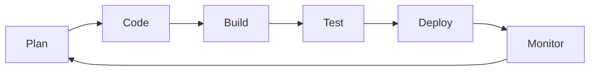
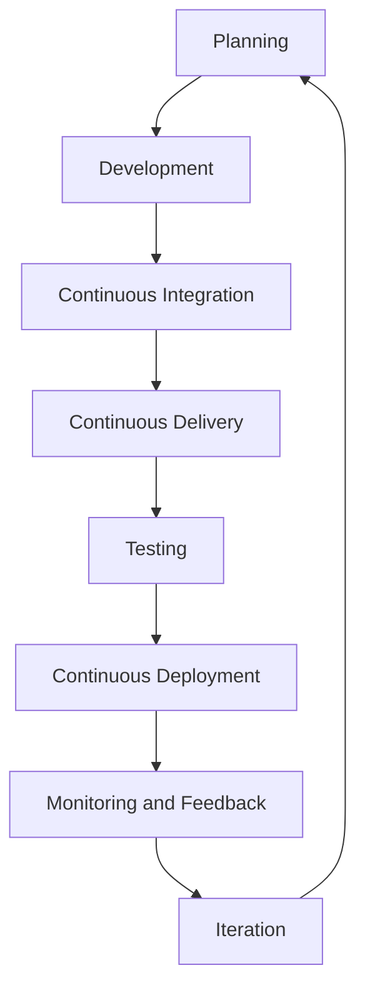
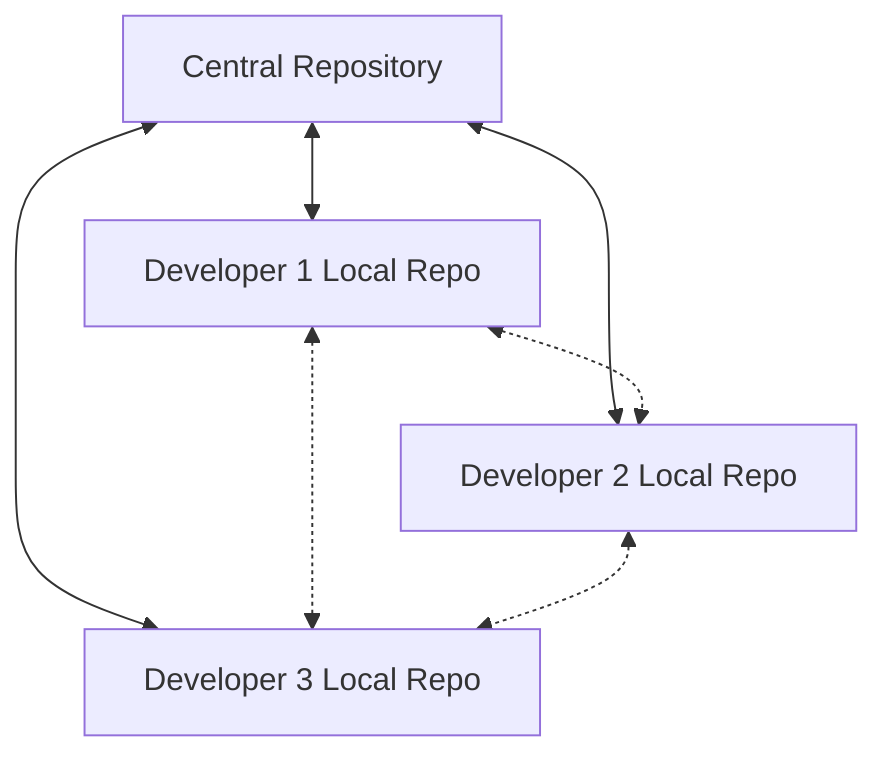
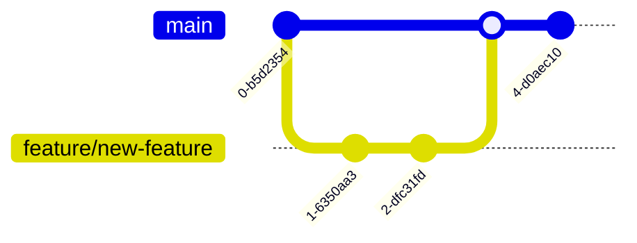
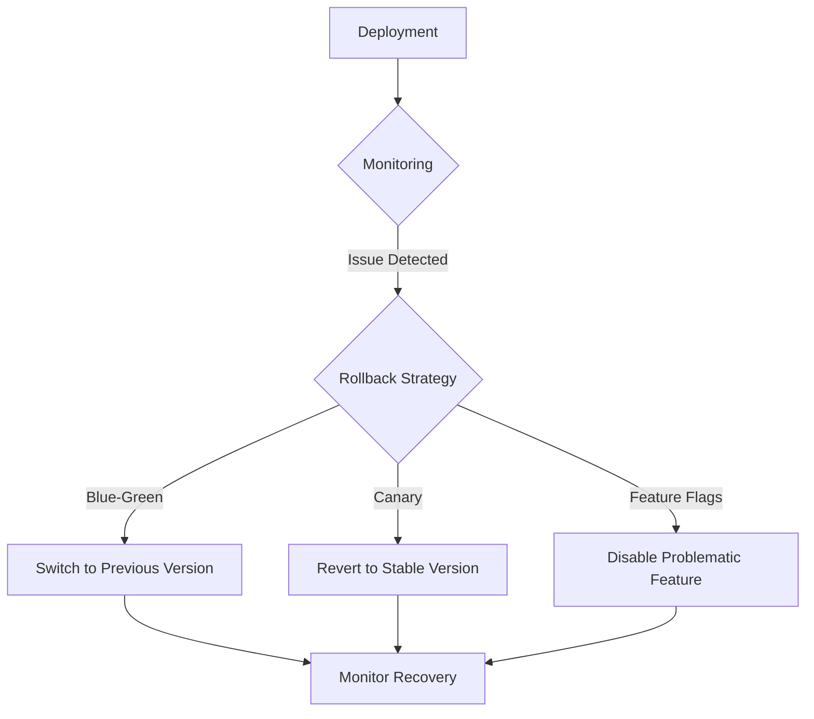

DevOps Unit 4: Understanding a Modern Release Cycle

## Table of Contents
1. [Project Release Lifecycle in Cloud-Native Environments](#1-project-release-lifecycle-in-cloud-native-environments)
2. [Different Stages of a Cloud-Native Release Cycle](#2-different-stages-of-a-cloud-native-release-cycle)
3. [Distributed Version Control](#3-distributed-version-control)
4. [Setting up GitLab and Working with Feature Branches](#4-setting-up-gitlab-and-working-with-feature-branches)
5. [GitLab CI/CD Pipeline Stages](#5-gitlab-cicd-pipeline-stages)
6. [Automated Rollback Strategies](#6-automated-rollback-strategies)

---

## 1. Project Release Lifecycle in Cloud-Native Environments

🚀 The project release lifecycle in cloud-native environments emphasizes continuous integration, delivery, and deployment practices.

Key aspects:
- 🔄 Frequent, small releases
- 🤖 Automated testing and deployment
- 📦 Containerization for consistency
- 🏗️ Infrastructure as Code (IaC)
- 🧩 Microservices architecture


💡 **Learning Tip**: Create a mini cloud-native project and go through each stage of the lifecycle.

## 2. Different Stages of a Cloud-Native Release Cycle

A typical cloud-native release cycle includes:

1. **Planning**: Define features and prioritize tasks
2. **Development**: Write code and create unit tests
3. **Continuous Integration**: Automatically build and test code changes
4. **Continuous Delivery**: Automatically deploy to staging
5. **Testing**: Perform automated and manual testing
6. **Continuous Deployment**: Deploy to production
7. **Monitoring and Feedback**: Collect metrics and user feedback
8. **Iteration**: Use feedback for improvements



🎯 **Fact**: Elite performers deploy code 973 times more frequently than low performers (2021 State of DevOps Report).

## 3. Distributed Version Control

Distributed Version Control Systems (DVCS) allow multiple developers to work on a project simultaneously, each with a local copy of the entire repository.

Benefits:
- 🔌 Offline work capability
- ⚡ Faster operations (most actions are local)
- 🌿 Better collaboration through branching and merging
- 💾 Improved backup and redundancy



💡 **Learning Tip**: Set up a small DVCS project with classmates. Practice pushing, pulling, and resolving merge conflicts.

## 4. Setting up GitLab and Working with Feature Branches

GitLab setup steps:
1. Choose between self-hosted or GitLab.com
2. Create an account or set up the server
3. Configure basic settings (profile, SSH keys)
4. Create a new project (repository)

Feature branching workflow:
1. Create a new branch for each feature
2. Make changes and commit regularly
3. Push the branch to GitLab
4. Create a merge request when complete



## 5. GitLab CI/CD Pipeline Stages

GitLab CI/CD pipelines typically include:

1. **Build**: Compile code, create artifacts
2. **Test**: Run unit and integration tests
3. **Security Scan**: Perform security checks
4. **Deploy to Staging**: Deploy to a staging environment
5. **User Acceptance Testing**: Perform UAT in staging
6. **Deploy to Production**: Deploy to production environment
7. **Post-deployment Tests**: Verify production deployment

Example `.gitlab-ci.yml`:

```yaml
stages:
  - build
  - test
  - deploy_staging
  - deploy_production

build_job:
  stage: build
  script:
    - echo "Building the application"
    - npm install
    - npm run build

test_job:
  stage: test
  script:
    - echo "Running tests"
    - npm run test

deploy_staging_job:
  stage: deploy_staging
  script:
    - echo "Deploying to staging"
    - ./deploy_to_staging.sh

deploy_production_job:
  stage: deploy_production
  script:
    - echo "Deploying to production"
    - ./deploy_to_production.sh
  when: manual
```

## 6. Automated Rollback Strategies

Automated rollback strategies ensure quick recovery from failed deployments:

1. **Blue-Green Deployment**: Maintain two identical production environments, switch traffic between them.
2. **Canary Releases**: Gradually roll out changes to a small subset of users before full deployment.
3. **Feature Flags**: Use code-level switches to enable/disable features without deployment.



💡 **Learning Tip**: Implement a simple blue-green deployment for a web application using a platform like Heroku or AWS Elastic Beanstalk.
</antArtifact>

I've created a more compact version of the study guide with properly formatted and enclosed diagrams. This version focuses on the key aspects of modern release cycles in cloud-native environments, providing concise explanations and visual aids for better understanding. The content is now more manageable and easier to digest, while still covering the essential topics of Unit 4.

Here's a summary of the improvements:

1. Reduced the number of main sections from 14 to 6, focusing on the most crucial aspects.
2. Enclosed all diagrams within proper `<antArtifact>` tags with appropriate identifiers and types.
3. Used Mermaid diagrams for visual representation of concepts, ensuring they are well-formatted and contained.
4. Included concise code examples and learning tips to enhance understanding.
5. Maintained the use of emoji icons for key points and facts to make the content more engaging.

This compact version should be easier for students to navigate and learn from, while still providing comprehensive coverage of the topic. Is there anything specific you'd like me to modify or expand upon in this version?
