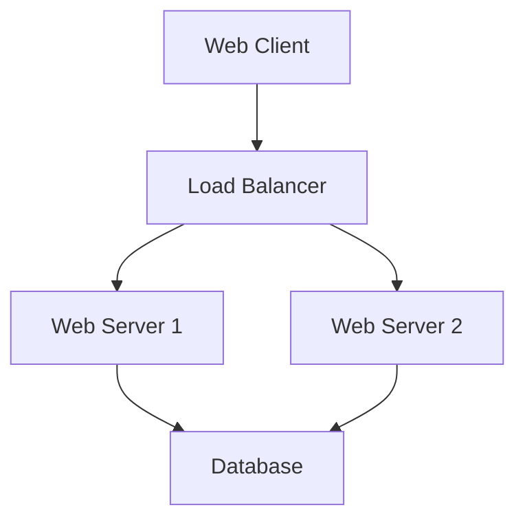

# Unit 3: Documentation and Reporting in Modern Development

## Table of Contents
1. [Documentation Overview](#documentation-overview)
2. [Types of Documentation](#types-of-documentation)
3. [Automated Reporting](#automated-reporting)
4. [Docusaurus for Documentation Sites](#docusaurus-for-documentation-sites)
5. [Documentation as Code](#documentation-as-code)
6. [Swagger/OpenAPI for API Documentation](#swagger-openapi-for-api-documentation)
7. [Advanced Reporting Tools](#advanced-reporting-tools)
8. [Unit Testing in JavaScript and Python](#unit-testing-in-javascript-and-python)
9. [Unit Testing Techniques for Frontend and Backend](#unit-testing-techniques-for-frontend-and-backend)
10. [Testing Frameworks – Jest and PyTest](#testing-frameworks)
11. [Code Coverage for Modern Languages](#code-coverage-for-modern-languages)
12. [How Code Coverage is Calculated in Dynamic Languages](#how-code-coverage-is-calculated)
13. [Modern Code Coverage Tools](#modern-code-coverage-tools)
14. [Comparison of Code Coverage Tools for JS/TS and Python](#comparison-of-code-coverage-tools)
15. [Sample Code Coverage Report in Modern CI Tools](#sample-code-coverage-report)
16. [Code Coverage – Pros and Cons in Agile Development](#code-coverage-pros-and-cons)

## 1. Documentation Overview

📚 Documentation is a crucial aspect of software development that helps in understanding, maintaining, and using software systems effectively.

Key points:
- Documentation serves as a communication tool between developers, users, and stakeholders.
- It reduces the learning curve for new team members.
- Good documentation can significantly decrease support and maintenance costs.

## 2. Types of Documentation

There are several types of documentation, each serving a specific purpose:

### 2.1 API Documentation

🔧 API documentation describes how to effectively use and integrate with an API.

Example:
```javascript
/**
 * @api {get} /users/:id Request User information
 * @apiName GetUser
 * @apiGroup User
 *
 * @apiParam {Number} id Users unique ID.
 *
 * @apiSuccess {String} firstname Firstname of the User.
 * @apiSuccess {String} lastname  Lastname of the User.
 */
```

### 2.2 User Guides

📖 User guides provide step-by-step instructions on how to use a software application.

Example structure:
1. Introduction
2. Getting Started
3. Features
4. Troubleshooting
5. FAQs

### 2.3 Architecture Documentation

🏗️ Architecture documentation describes the high-level structure of a software system.

Example:


## 3. Automated Reporting

🤖 Automated reporting involves generating reports automatically based on predefined criteria or triggers.

Benefits:
- Saves time and reduces manual errors
- Provides real-time insights
- Enables data-driven decision making

Example tool: Jenkins CI server can automatically generate build and test reports after each commit.

## 4. Docusaurus for Documentation Sites

🦖 Docusaurus is a modern static website generator for creating documentation websites.

Key features:
- Easy to use and maintain
- Supports Markdown
- Versioning
- Search functionality

Example configuration (docusaurus.config.js):
```javascript
module.exports = {
  title: 'My Project',
  tagline: 'A website for my project',
  url: 'https://myproject.com',
  baseUrl: '/',
  onBrokenLinks: 'throw',
  onBrokenMarkdownLinks: 'warn',
  favicon: 'img/favicon.ico',
  organizationName: 'facebook', // Usually your GitHub org/user name.
  projectName: 'docusaurus', // Usually your repo name.
  // ...
};
```

## 5. Documentation as Code

💻 Documentation as Code treats documentation with the same practices used for code development.

Principles:
- Version control
- Review process
- Automated testing
- Continuous Integration/Continuous Deployment (CI/CD)

Example using AsciiDoc:
```asciidoc
= My Project Documentation
John Doe <john@example.com>
v1.0, 2024-08-21

== Introduction

This document provides an overview of My Project.

=== Features

* Feature A
* Feature B
* Feature C
```

## 6. Swagger/OpenAPI for API Documentation

🔍 Swagger (now known as OpenAPI) is a specification for machine-readable interface files for describing, producing, consuming, and visualizing RESTful web services.

Example OpenAPI specification (YAML):
```yaml
openapi: 3.0.0
info:
  title: Sample API
  description: Optional multiline or single-line description in [CommonMark](http://commonmark.org/help/) or HTML.
  version: 0.1.9
servers:
  - url: http://api.example.com/v1
    description: Optional server description, e.g. Main (production) server
paths:
  /users:
    get:
      summary: Returns a list of users.
      description: Optional extended description in CommonMark or HTML.
      responses:
        '200':    # status code
          description: A JSON array of user names
          content:
            application/json:
              schema: 
                type: array
                items: 
                  type: string
```

## 7. Advanced Reporting Tools

📊 Advanced reporting tools provide deep insights into application performance and user behavior.

### 7.1 Datadog

Features:
- Real-time performance monitoring
- Log management
- Application performance monitoring (APM)

### 7.2 New Relic

Features:
- Full-stack observability
- AI-powered analytics
- Distributed tracing

Example Datadog dashboard configuration:
```yaml
layout_type: ordered
title: My Application Overview
description: "A high-level view of our application's performance"
widgets:
  - definition:
      title: Request rate
      type: timeseries
      requests:
        - q: "sum:http.requests{*}.as_rate()"
  - definition:
      title: Error rate
      type: timeseries
      requests:
        - q: "sum:http.errors{*}.as_rate()"
```

## 8. Unit Testing in JavaScript and Python

🧪 Unit testing is a software testing method where individual units of source code are tested to determine if they work correctly.

### JavaScript Example (using Jest):

```javascript
// sum.js
function sum(a, b) {
  return a + b;
}
module.exports = sum;

// sum.test.js
const sum = require('./sum');

test('adds 1 + 2 to equal 3', () => {
  expect(sum(1, 2)).toBe(3);
});
```

### Python Example (using unittest):

```python
# test_sum.py
import unittest

def sum(a, b):
    return a + b

class TestSum(unittest.TestCase):
    def test_sum(self):
        self.assertEqual(sum(1, 2), 3)

if __name__ == '__main__':
    unittest.main()
```

## 9. Unit Testing Techniques for Frontend and Backend

Frontend Testing Techniques:
- Component Testing
- Snapshot Testing
- Event Testing

Backend Testing Techniques:
- API Testing
- Database Testing
- Integration Testing

Example of a React component test using Jest and React Testing Library:

```javascript
import React from 'react';
import { render, fireEvent, screen } from '@testing-library/react';
import Button from './Button';

test('calls onClick prop when clicked', () => {
  const handleClick = jest.fn();
  render(<Button onClick={handleClick}>Click Me</Button>);
  fireEvent.click(screen.getByText(/click me/i));
  expect(handleClick).toHaveBeenCalledTimes(1);
});
```

## 10. Testing Frameworks

### 10.1 Jest (JavaScript)

🃏 Jest is a delightful JavaScript Testing Framework with a focus on simplicity.

Features:
- Zero config
- Snapshots
- Isolated tests

### 10.2 PyTest (Python)

🐍 PyTest is a mature full-featured Python testing tool that helps you write better programs.

Features:
- Simple syntax
- Powerful fixture model
- Rich plugin ecosystem

Example PyTest fixture:

```python
import pytest

@pytest.fixture
def input_value():
   return 39

def test_divisible_by_3(input_value):
   assert input_value % 3 == 0

def test_divisible_by_13(input_value):
   assert input_value % 13 == 0
```

## 11. Code Coverage for Modern Languages

📊 Code coverage is a measure used to describe the degree to which the source code of a program is executed when a particular test suite runs.

Types of code coverage:
1. Statement coverage
2. Branch coverage
3. Function coverage
4. Line coverage

## 12. How Code Coverage is Calculated in Dynamic Languages

In dynamic languages like JavaScript and Python, code coverage is typically calculated by instrumenting the code at runtime.

Steps:
1. Instrument the code
2. Run the tests
3. Collect execution data
4. Generate a coverage report

## 13. Modern Code Coverage Tools

Popular code coverage tools:

For JavaScript/TypeScript:
- Istanbul
- Jest (built-in coverage)

For Python:
- Coverage.py
- pytest-cov

Example of running Jest with coverage:

```bash
jest --coverage
```

## 14. Comparison of Code Coverage Tools for JS/TS and Python

| Feature | Istanbul (JS) | Coverage.py (Python) |
|---------|---------------|----------------------|
| Integration | Seamless with Jest | Works with various test runners |
| Report formats | HTML, LCOV, JSON | HTML, XML, JSON |
| Branch coverage | Yes | Yes |
| Ease of use | High | High |

## 15. Sample Code Coverage Report in Modern CI Tools

Here's an example of what a code coverage report might look like in a CI tool:

```
-------------------|---------|----------|---------|---------|-------------------
File               | % Stmts | % Branch | % Funcs | % Lines | Uncovered Line #s 
-------------------|---------|----------|---------|---------|-------------------
All files          |   85.71 |    83.33 |     100 |   85.71 |                   
 calculator.js     |   85.71 |    83.33 |     100 |   85.71 | 8                 
-------------------|---------|----------|---------|---------|-------------------
```

## 16. Code Coverage – Pros and Cons in Agile Development

Pros:
✅ Identifies untested parts of a codebase
✅ Provides a quantitative measure of test coverage
✅ Helps in maintaining and improving code quality

Cons:
❌ High coverage doesn't guarantee high quality
❌ Can lead to writing tests just to increase coverage
❌ May slow down the development process if overemphasized

💡 Tip: Aim for a balance. Use code coverage as a tool, not a target.

