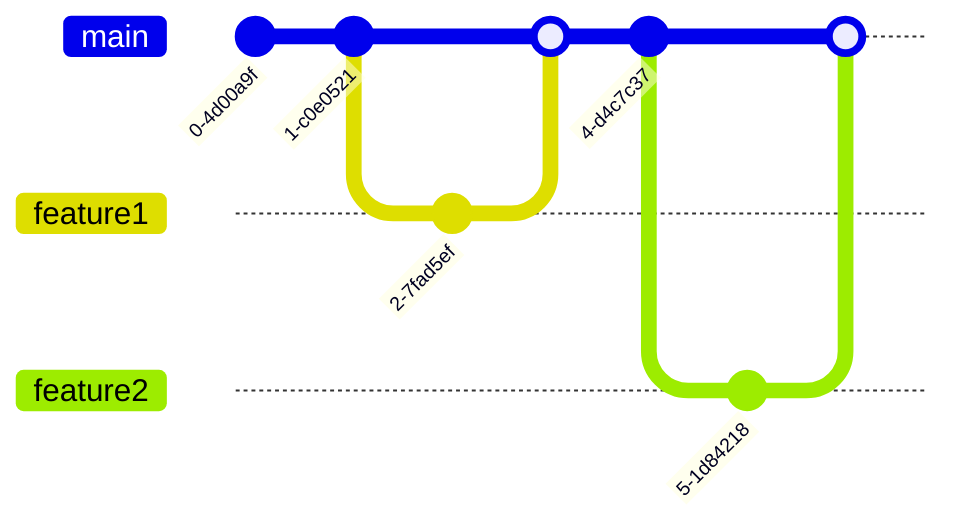

# Unit 5: Advanced Build and Release Strategies

## Table of Contents
1. [Continuous Integration and Continuous Delivery](#cicd)
2. [Advanced CI/CD Platforms](#platforms)
3. [Deployment Strategies](#deployment)
4. [Feature Management](#feature-management)
5. [Development Workflows](#workflows)

## 1. Continuous Integration and Continuous Delivery (CI/CD) 

### Understanding CI/CD in Cloud-Native Environments

CI/CD is the backbone of modern software delivery, especially in cloud-native environments. Here's the basic workflow:

### Key Components
- **Continuous Integration**: Automated build and test when code is pushed
- **Continuous Delivery**: Automated deployment to staging environments
- **Continuous Deployment**: Automated deployment to production

## 2. Advanced CI/CD Platforms 

### GitLab CI/CD Advanced Features

### GitHub Actions Advanced Workflows
- Matrix builds
- Reusable workflows
- Environment protection rules
- Custom actions

### Azure DevOps Pipelines

## 3. Deployment Strategies 

### Blue-Green Deployments in Kubernetes

### Canary Releases with Istio

Key concepts:
- Traffic splitting
- Progressive delivery
- Automated rollback
- Metrics-based promotion

## 4. Feature Management 

### Feature Flags Implementation

### A/B Testing in Cloud Environments
- User segmentation
- Metrics collection
- Statistical analysis
- Automated rollout

## 5. Development Workflows 

### Trunk-Based Development

### GitFlow Strategy

## Practice Questions
1. Compare and contrast Blue-Green and Canary deployment strategies.
2. How would you implement feature flags in a microservices architecture?
3. What are the key differences between GitFlow and Trunk-Based Development?
4. Design a CI/CD pipeline for a cloud-native application using GitHub Actions.
5. Explain the role of Istio in implementing Canary releases.
