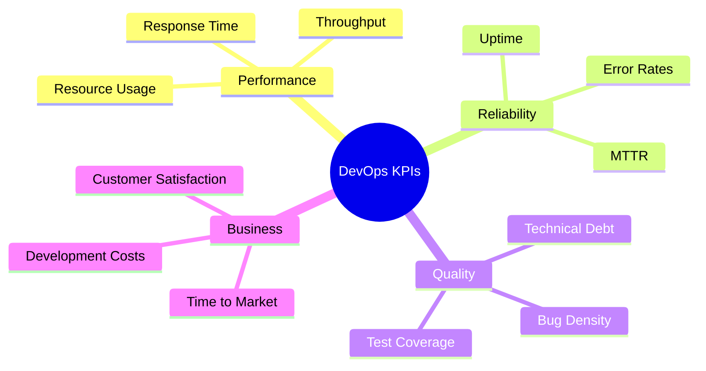
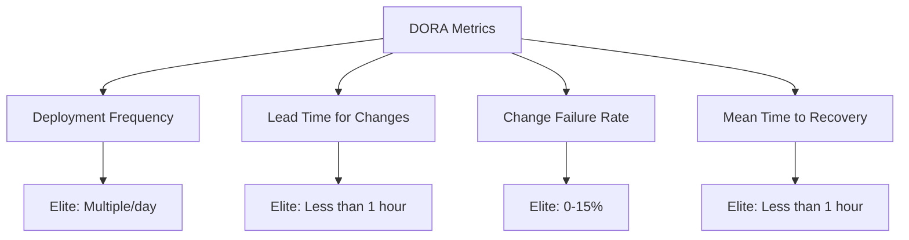
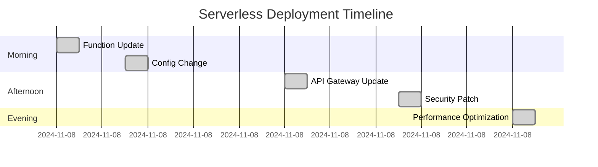
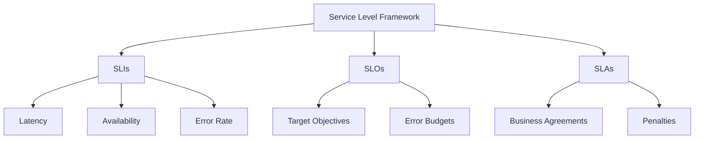
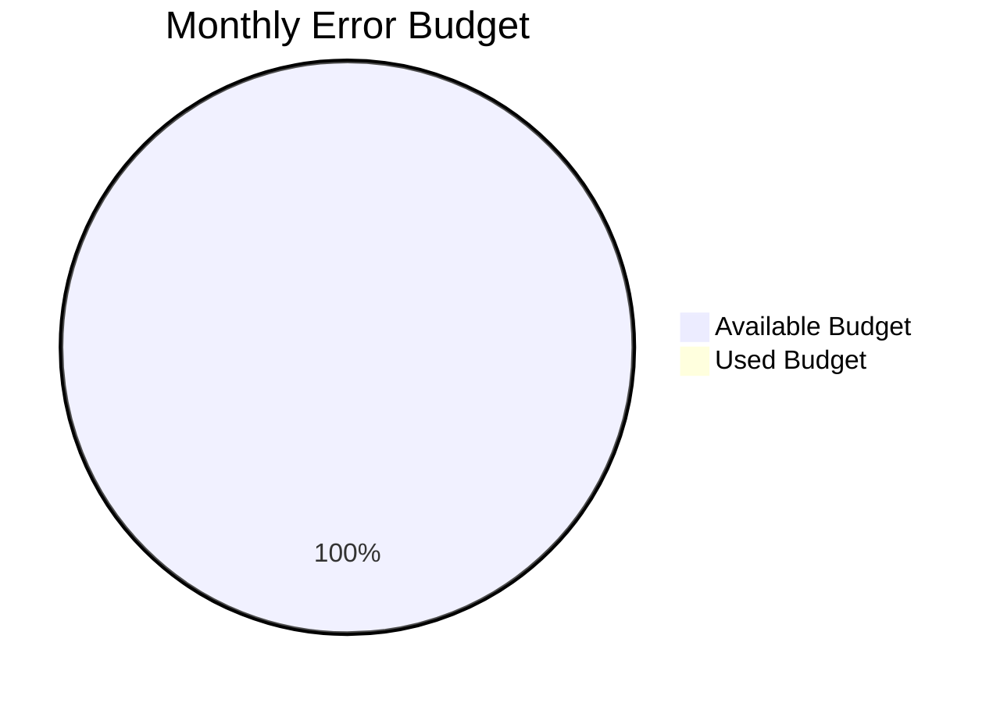
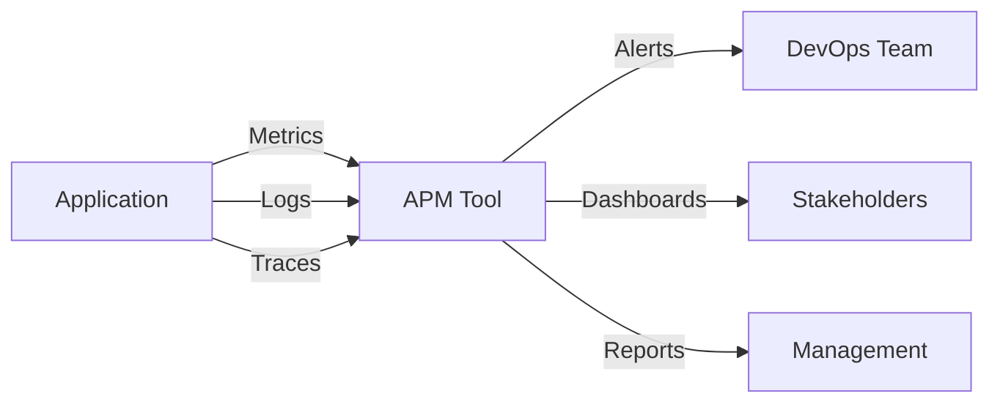
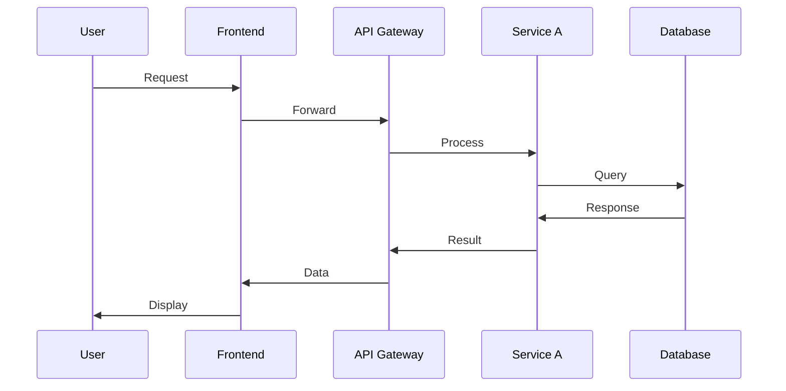
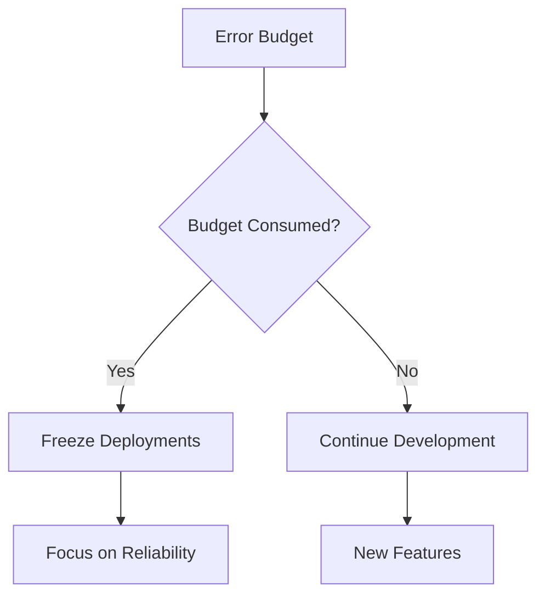

# Unit 6: DevOps Metrics and Observability

## Table of Contents
1. [Key Performance Indicators](#kpis)
2. [DORA Metrics](#dora)
3. [Service Level Concepts](#sls)
4. [Monitoring and Observability](#monitoring)

## 1. Key Performance Indicators (KPIs) 

### Cloud-Native DevOps KPIs

## 2. DORA Metrics 

### Key Metrics Framework

### Metrics in Different Environments

#### Serverless Deployment Frequency

## 3. Service Level Concepts 

### Service Level Framework

### Error Budget Implementation

## 4. Monitoring and Observability 

### Application Performance Monitoring (APM)

### Distributed Tracing

### Key APM Metrics
1. Response Time
2. Error Rates
3. Transaction Volume
4. Resource Utilization
5. User Experience

## SRE Practices

### Error Budget Policy

## Practice Questions
1. How would you implement SLOs for a microservices architecture?
2. Calculate the Change Failure Rate for a given set of deployments.
3. Design an error budget policy for a cloud-native application.
4. What metrics would you track for a serverless application?
5. How does distributed tracing help in monitoring microservices?

## Additional Resources
1. Google's SRE Books
2. DORA State of DevOps Reports
3. Datadog Documentation
4. OpenTelemetry Guidelines
5. Prometheus and Grafana Tutorials
