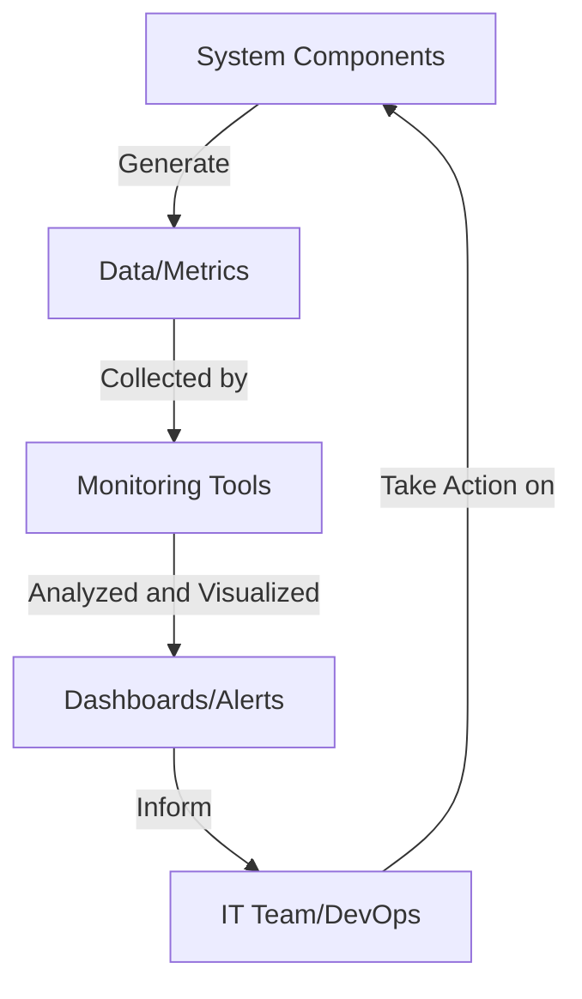
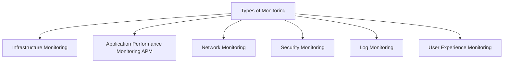
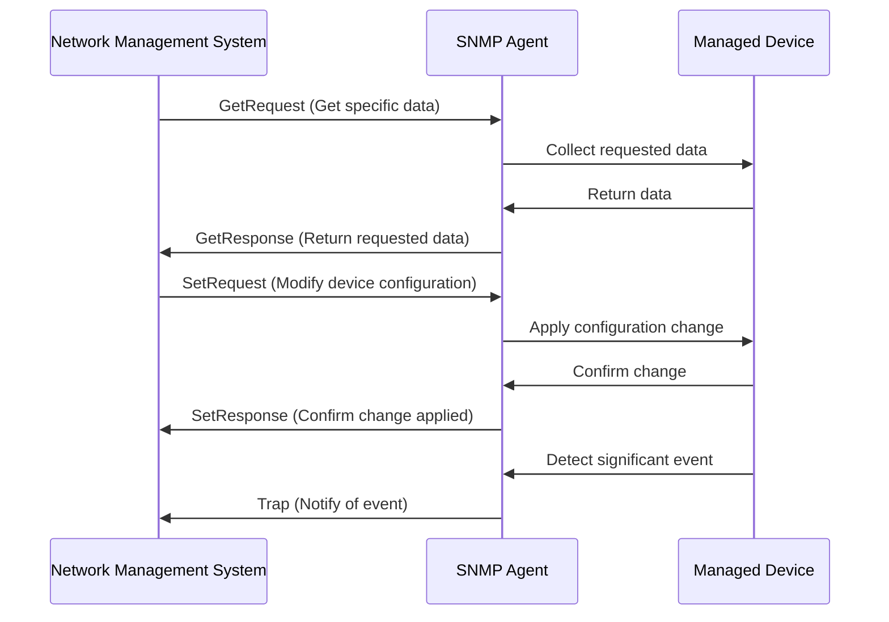

# Unit 4: Introduction to Monitoring

## Table of Contents
1. [What is Monitoring?](#what-is-monitoring)
2. [Need for Monitoring](#need-for-monitoring)
3. [Types of Monitoring](#types-of-monitoring)
4. [Linux Monitoring Metrics](#linux-monitoring-metrics)
5. [Linux In-Built Monitoring Tools](#linux-in-built-monitoring-tools)
6. [Introduction to SNMP](#introduction-to-snmp)
7. [Other Monitoring Tools](#other-monitoring-tools)

## 1. What is Monitoring?

Monitoring in the context of IT and DevOps refers to the process of observing and tracking the performance, health, and behavior of computer systems, networks, and applications in real-time. It involves collecting, analyzing, and visualizing data from various sources to ensure optimal operation and quick issue resolution.


## 2. Need for Monitoring

Monitoring is crucial in modern IT environments for several reasons:

1. **Proactive Problem Detection**: Identify issues before they impact users or services.
2. **Performance Optimization**: Track resource usage and optimize system performance.
3. **Capacity Planning**: Forecast future resource needs based on historical data.
4. **Security**: Detect unusual activities or potential security breaches.
5. **Compliance**: Ensure systems meet regulatory requirements.
6. **Cost Management**: Optimize resource allocation and reduce unnecessary expenses.

## 3. Types of Monitoring

There are several types of monitoring, each focusing on different aspects of IT infrastructure:



1. **Infrastructure Monitoring**: Focuses on hardware and OS-level metrics.
   - Example: Monitoring CPU usage, memory consumption, disk I/O on servers.

2. **Application Performance Monitoring (APM)**: Tracks the performance and availability of software applications.
   - Example: Monitoring response times, error rates, and transaction volumes of a web application.

3. **Network Monitoring**: Observes network devices, traffic, and connectivity.
   - Example: Monitoring network bandwidth usage, latency, and packet loss.

4. **Security Monitoring**: Detects and alerts on potential security threats.
   - Example: Monitoring failed login attempts, unusual file system activities, or network intrusion attempts.

5. **Log Monitoring**: Analyzes log files from various sources to detect issues or trends.
   - Example: Monitoring application logs for error messages or system logs for critical events.

6. **User Experience Monitoring**: Tracks the end-user experience of applications or services.
   - Example: Monitoring page load times, user journey completion rates, or app crashes on mobile devices.

## 4. Linux Monitoring Metrics

Linux systems provide a wealth of metrics that can be monitored to ensure optimal performance and health. Here are some key metrics:

1. **CPU Usage**: Measures the utilization of the CPU.
2. **Memory Usage**: Tracks RAM usage, including free, used, and cached memory.
3. **Disk I/O**: Monitors read/write operations and speeds on storage devices.
4. **Network Traffic**: Measures incoming and outgoing network traffic.
5. **Load Average**: Represents the average system load over time.
6. **Process Count**: Tracks the number of running processes.
7. **Swap Usage**: Monitors the use of swap space.
8. **File System Usage**: Tracks disk space usage across file systems.

## 5. Linux In-Built Monitoring Tools

Linux provides several built-in tools for monitoring system performance:

1. **top**: Real-time view of system processes and resource usage.
   ```bash
   $ top
   ```

2. **htop**: An enhanced version of top with a more user-friendly interface.
   ```bash
   $ htop
   ```

3. **vmstat**: Reports virtual memory statistics.
   ```bash
   $ vmstat 5 5  # Report every 5 seconds, 5 times
   ```

4. **iostat**: Reports CPU and I/O statistics.
   ```bash
   $ iostat -x 5 5  # Extended report every 5 seconds, 5 times
   ```

5. **netstat**: Displays network connections and statistics.
   ```bash
   $ netstat -tuln  # Show TCP and UDP listening sockets
   ```

6. **df**: Reports file system disk space usage.
   ```bash
   $ df -h  # Human-readable format
   ```

7. **sar**: Collects, reports, and saves system activity information.
   ```bash
   $ sar -u 5 5  # CPU usage every 5 seconds, 5 times
   ```

## 6. Introduction to SNMP

SNMP (Simple Network Management Protocol) is a widely used protocol for collecting and organizing information about managed devices on IP networks.

Key SNMP Concepts:
- **Managed Devices**: Network elements that are monitored (e.g., routers, switches, servers).
- **Agents**: Software running on managed devices that collect and store management information.
- **Network Management System (NMS)**: Software used to monitor and control managed devices.
- **Management Information Base (MIB)**: A hierarchical database of information about managed devices.



## 7. Other Monitoring Tools

While Linux provides many built-in tools, there are several other popular monitoring tools used in modern IT environments:

1. **Prometheus**: An open-source monitoring and alerting toolkit.
   - Use Case: Monitoring microservices-based architectures.

2. **Grafana**: A multi-platform open-source analytics and interactive visualization web application.
   - Use Case: Creating dashboards to visualize metrics from various data sources.

3. **Nagios**: A powerful monitoring system that enables organizations to identify and resolve IT infrastructure problems.
   - Use Case: Monitoring network services, host resources, and server health.

4. **Zabbix**: An enterprise-class open-source distributed monitoring solution.
   - Use Case: Monitoring large-scale IT environments with diverse infrastructure components.

5. **ELK Stack (Elasticsearch, Logstash, Kibana)**: A set of tools for searching, analyzing, and visualizing logs in real-time.
   - Use Case: Centralized log management and analysis.

6. **Datadog**: A monitoring and analytics platform for large-scale applications.
   - Use Case: Monitoring cloud-scale applications and infrastructure.

Remember, the choice of monitoring tool often depends on the specific requirements of the infrastructure, the scale of operations, and the team's expertise.

---

This study material provides a comprehensive overview of monitoring in IT environments, covering the basics, types, Linux-specific metrics and tools, SNMP, and popular monitoring solutions. As you progress in your DevOps journey, hands-on experience with these tools and concepts will be invaluable.
