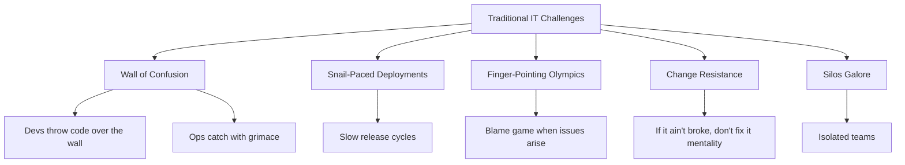
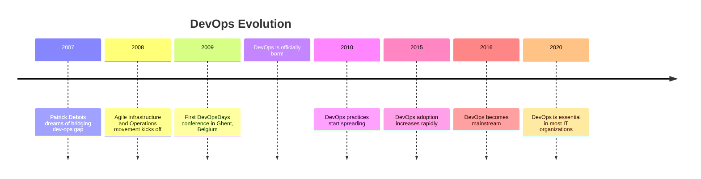
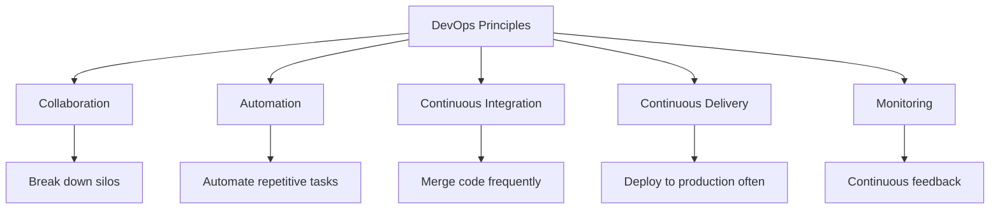
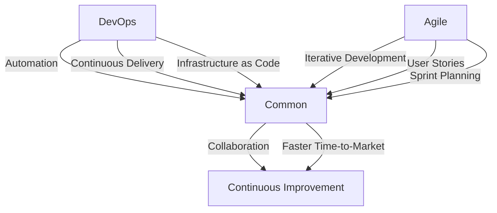
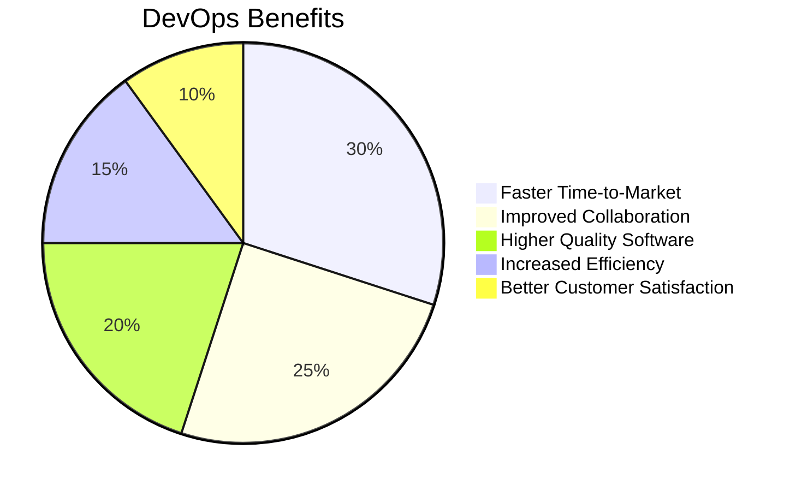

# DevOps Overview: Unit 2
## Introduction to DevOps

### 1. Definition of DevOps

Hey there, future DevOps rockstars! Ready to dive into the world where developers and operations finally learn to play nice? Buckle up, because we're about to explore DevOps – the superhero of modern IT!

#### Challenges of Traditional IT Systems & Processes

Remember the good old days when dev teams and ops teams were like oil and water? Yeah, those weren't actually good days. Let's break down why:

- **The Wall of Confusion**: Devs threw code over the wall, ops caught it (usually with a grimace).
- **Snail-Paced Deployments**: Releasing software was slower than a sloth on vacation.
- **Finger-Pointing Olympics**: When things went wrong, blame flew faster than a caffeinated squirrel.
- **Change Resistance**: "If it ain't broke, don't fix it" was the mantra (spoiler: it was often broke).
- **Silos Galore**: Teams were more isolated than introverts at a rave.

**Fun Fact:** The average enterprise used to release software updates 1-2 times a year. Now, with DevOps, companies like Amazon deploy code every 11.7 seconds! Talk about a glow-up!

### 2. History and Emergence of DevOps

DevOps didn't just appear out of thin air (though that would've been cool). It evolved like a Pokemon, but with less catching and more collaboration.

Key Milestones:
- 2007: Patrick Debois dreams of bridging the dev-ops gap (while probably drinking Belgian beer).
- 2008: Agile Infrastructure and Operations movement kicks off.
- 2009: First DevOpsDays conference in Ghent, Belgium. DevOps is officially born!
- 2010-2015: DevOps practices spread like wildfire (but the good kind).
- 2016 onwards: DevOps becomes mainstream, and IT managers everywhere breathe a sigh of relief.

### 3. DevOps Definition and Principles

So, what exactly is DevOps? It's not just a buzzword to impress your tech-savvy friends at parties!

DevOps is a set of practices that combines software development (Dev) and IT operations (Ops). It aims to shorten the systems development life cycle and provide continuous delivery with high software quality.

Key Principles:
1. **Collaboration**: Break down silos between development and operations teams.
2. **Automation**: Automate repetitive tasks to reduce errors and increase efficiency.
3. **Continuous Integration**: Merge code changes frequently to detect and fix issues early.
4. **Continuous Delivery**: Deploy to production often, ensuring a constant flow of new features.
5. **Monitoring**: Implement continuous feedback loops to improve processes and performance.

### 4. DevOps and Agile

DevOps and Agile are like peanut butter and jelly – great on their own, but even better together!

While Agile focuses on iterative development and customer feedback, DevOps extends these principles to include operations and delivery. Together, they create a powerful approach to software development and deployment.

Shared Values:
- Collaboration
- Continuous Improvement
- Faster Time-to-Market

DevOps-specific practices:
- Automation
- Continuous Delivery
- Infrastructure as Code

Agile-specific practices:
- Iterative Development
- User Stories
- Sprint Planning

### 5. The Need for Building a Business Use Case for DevOps

Convincing your boss to adopt DevOps is like persuading a cat to take a bath – it requires strategy and a clear value proposition!

Key Benefits of DevOps:
1. **Faster Time-to-Market** (30%): Streamlined processes mean quicker releases.
2. **Improved Collaboration** (25%): No more dev vs. ops battles!
3. **Higher Quality Software** (20%): Catch bugs early, deploy with confidence.
4. **Increased Efficiency** (15%): Automation reduces manual errors and saves time.
5. **Better Customer Satisfaction** (10%): Faster fixes and new features make happy users.

Building a business case for DevOps involves showcasing these benefits and demonstrating how they align with your organization's goals. Remember, it's not just about cool tech – it's about delivering value to your business and customers!

Tips for Building Your DevOps Business Case:
1. Align with business objectives
2. Quantify potential savings and improvements
3. Start small with a pilot project
4. Highlight success stories from other companies
5. Address potential challenges and mitigation strategies

### Conclusion

And there you have it, folks! You've just taken your first step into the wonderful world of DevOps. Remember, DevOps is more than just a set of tools or practices – it's a culture, a mindset, and a way of life (okay, maybe that's a bit dramatic, but you get the point).

As you continue your DevOps journey, keep in mind that it's all about collaboration, automation, and continuous improvement. Break down those silos, automate all the things, and never stop learning!

Key Takeaways:
1. DevOps bridges the gap between development and operations.
2. It evolved from traditional IT challenges and Agile principles.
3. Core principles include collaboration, automation, and continuous improvement.
4. DevOps complements Agile methodologies.
5. Building a business case is crucial for successful DevOps adoption.

Now go forth and DevOps like a boss! 🚀

**Remember:** This is just the beginning of your DevOps adventure. Keep exploring, experimenting, and most importantly, have fun with it!
