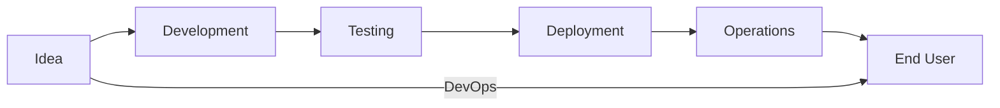
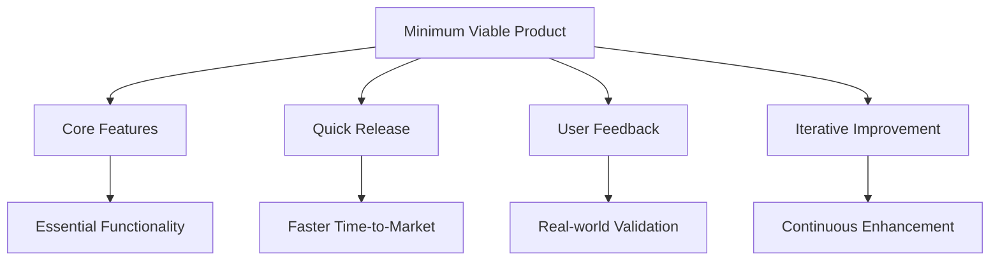
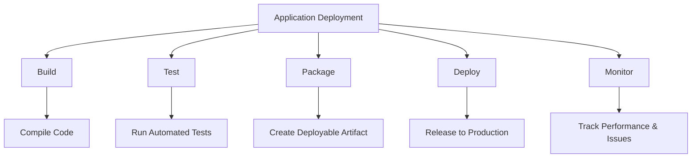
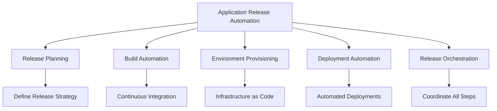
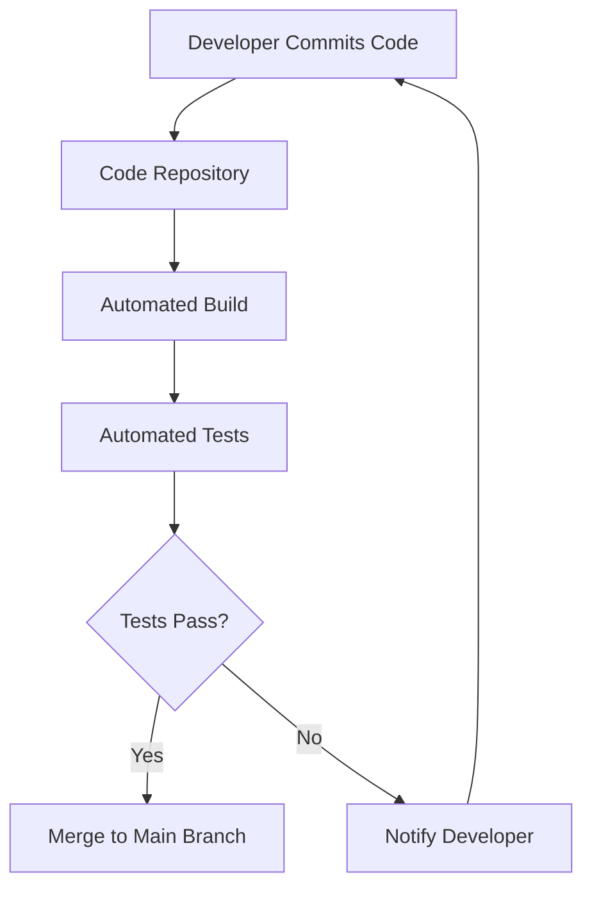
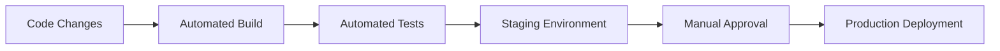

# DevOps Overview: Unit 3
## Purpose of DevOps

### 1. Purpose of DevOps

Welcome back, DevOps enthusiasts! Ready to dive deeper into the "why" behind DevOps? Buckle up, because we're about to explore the purpose that drives this game-changing approach to software development and operations.

The core purpose of DevOps is to optimize the flow of value from idea to end user. It's like creating a superhighway for your software, removing all the traffic jams and roadblocks along the way.

Key Objectives:
1. **Speed**: Accelerate time-to-market
2. **Reliability**: Ensure high-quality, stable releases
3. **Scale**: Manage complex systems efficiently
4. **Collaboration**: Break down silos between teams
5. **Security**: Integrate security throughout the lifecycle (DevSecOps)

### 2. Minimum Viable Product (MVP)

Ever heard the phrase "perfect is the enemy of good"? That's where MVP comes in!

An MVP is the simplest version of a product that can be released to customers while still providing value. It's like sending out a scout before committing your entire army.

#### Benefits of MVP:

1. **Faster Time-to-Market**: Launch quickly and gain a competitive edge.
2. **Risk Reduction**: Test your assumptions before full investment.
3. **User Feedback**: Get real-world input to guide development.
4. **Resource Efficiency**: Focus on what truly matters to users.
5. **Iterative Improvement**: Build a solid foundation for future enhancements.

**Fun Fact:** The term "Minimum Viable Product" was coined by Frank Robinson in 2001 and popularized by Eric Ries in his book "The Lean Startup".

### 3. Application Deployment

Application deployment is like sending your code child off to college – it's exciting, a bit scary, and requires careful preparation!

#### Automated Application Deployment

Automated deployment is like having a robot butler for your code – it's efficient, consistent, and doesn't complain about working overtime!

Benefits of Automation:
1. **Consistency**: Same process every time, reducing human errors.
2. **Speed**: Deployments can happen in minutes, not days.
3. **Frequency**: Enable multiple deployments per day.
4. **Reliability**: Reduced risk of deployment failures.
5. **Auditability**: Every step is logged and traceable.

### 4. Application Release Automation (ARA)

ARA is like the conductor of an orchestra, ensuring all instruments (or in our case, deployment steps) play in perfect harmony.

#### Components of Application Release Automation (ARA):

1. **Release Planning**: Define the what, when, and how of your release.
2. **Build Automation**: Compile code and create deployable artifacts automatically.
3. **Environment Provisioning**: Set up infrastructure on-demand (hello, Infrastructure as Code!).
4. **Deployment Automation**: Push code to target environments without manual intervention.
5. **Release Orchestration**: Coordinate all steps in the release process.

### 5. Continuous Integration (CI)

Continuous Integration is like a never-ending code party where everyone's invited, and the bouncer (automated tests) ensures only the cool kids (working code) get in.

#### Best Practices of CI:

1. **Maintain a Single Source Repository**: One ring to rule them all!
2. **Automate the Build**: No human button-pushing allowed.
3. **Make Your Build Self-Testing**: Trust, but verify.
4. **Everyone Commits to the Mainline Every Day**: Share the love (and the code).
5. **Every Commit Should Build the Mainline on an Integration Machine**: No

 broken windows policy.
6. **Keep the Build Fast**: Ain't nobody got time for slow builds.
7. **Test in a Clone of the Production Environment**: Mirror, mirror on the wall.
8. **Make it Easy for Anyone to Get the Latest Executable**: Sharing is caring.
9. **Everyone Can See What's Happening**: Transparency is key.
10. **Automate Deployment**: Because robots don't get tired.

#### Benefits of CI:

1. **Early Bug Detection**: Catch issues before they grow into monsters.
2. **Reduced Integration Problems**: No more "it works on my machine" syndrome.
3. **Improved Code Quality**: Constant feedback leads to better code.
4. **Faster Time-to-Market**: Ship features quicker than ever.
5. **Increased Confidence**: Know your code is always in a releasable state.

### 6. Continuous Delivery

Continuous Delivery is like having a conveyor belt from your development team straight to your users. It's all about keeping your software in a state where it can be released at any time.

#### Continuous Delivery Process:

1. **Code Changes**: Developers commit code to the repository.
2. **Automated Build**: The code is compiled and packaged.
3. **Automated Tests**: Unit tests, integration tests, and other automated checks are run.
4. **Staging Environment**: The application is deployed to a production-like environment for final testing.
5. **Manual Approval**: A human gives the green light for production deployment.
6. **Production Deployment**: The code is released to end-users.

**Key Difference**: Continuous Delivery vs. Continuous Deployment
- Continuous Delivery: Automated up to production, with manual approval for the final step.
- Continuous Deployment: Fully automated, including the production deployment step.

### Conclusion

And there you have it, folks! We've journeyed through the purpose of DevOps, from the concept of MVP to the intricacies of Continuous Integration and Delivery. Remember, DevOps is all about creating a smooth, efficient pipeline from idea to user, breaking down barriers, and fostering collaboration along the way.

Key Takeaways:
1. DevOps aims to optimize the flow of value from idea to end user.
2. MVP allows for quick market entry and iterative improvement.
3. Automated application deployment reduces errors and speeds up releases.
4. ARA orchestrates the entire release process.
5. CI ensures code is always in a releasable state.
6. Continuous Delivery provides a streamlined path to production.

As you continue your DevOps journey, keep these concepts in mind. They're not just buzzwords – they're the building blocks of modern, efficient software development and operations.

Now go forth and automate all the things! 🤖✨

**Remember:** DevOps is a journey, not a destination. Keep learning, keep improving, and most importantly, keep breaking down those silos!
