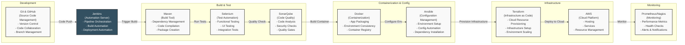

```mermaid
flowchart LR
    subgraph "Development"
        A["Git & GitHub\n(Source Code Management)\n- Version Control\n- Code Collaboration\n- Branch Management"]
    end

    subgraph "Build & Test"
        B["Maven\n(Build Tool)\n- Dependency Management\n- Code Compilation\n- Package Creation"]
        C["Selenium\n(Test Automation)\n- Functional Testing\n- UI Testing\n- Integration Tests"]
        D["SonarQube\n(Code Quality)\n- Code Analysis\n- Security Checks\n- Quality Gates"]
    end

    subgraph "Containerization & Config"
        E["Docker\n(Containerization)\n- App Packaging\n- Environment Consistency\n- Container Registry"]
        F["Ansible\n(Configuration Management)\n- Environment Setup\n- Config Automation\n- Dependency Installation"]
    end

    subgraph "Infrastructure"
        G["Terraform\n(Infrastructure as Code)\n- Cloud Resource Provisioning\n- Infrastructure Setup\n- Environment Scaling"]
        H["AWS\n(Cloud Platform)\n- Hosting\n- Services\n- Resource Management"]
    end

    subgraph "Monitoring"
        I["Prometheus/Nagios\n(Monitoring)\n- Performance Metrics\n- Health Checks\n- Alerts & Notifications"]
    end

    J["Jenkins\n(Automation Server)\n- Pipeline Orchestration\n- Build Automation\n- Deployment Automation"]

    %% Flow Connection
    A -->|"Code Push"| J
    J -->|"Trigger Build"| B
    B -->|"Run Tests"| C
    C -->|"Quality Check"| D
    D -->|"Build Container"| E
    E -->|"Configure Env"| F
    F -->|"Provision Infrastructure"| G
    G -->|"Deploy to Cloud"| H
    H -->|"Monitor"| I

    classDef default fill:#f9f9f9,stroke:#333,stroke-width:2px;
    classDef jenkins fill:#335061,color:#fff;
    class J jenkins;
```
