# DevOps in Industry: A Senior Engineer's Perspective on Career Paths, Roles, and Industry Reality

## Opening Narrative: The Real DevOps Journey

### My Journey: From Campus to Senior DevOps Engineer
Let me start by sharing my journey from where you are sitting right now to where I am today as a Senior DevOps Engineer at Accenture. Back in 2020, I was just like you - a final year student at Guru Nanak Dev Engineering College, wondering what DevOps really meant beyond the textbook definitions.

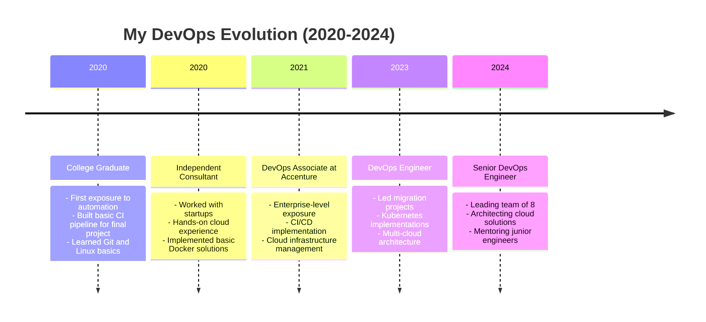

### The Reality vs. Expectations
When I started my journey, here's what I thought DevOps was vs. what I discovered:

#### Initial Expectations
1. Just automation and scripting
2. Only about tools and technology
3. Separate from development
4. Limited to deployment

#### Industry Reality
1. Business transformation enabler
2. Cultural shift in organizations
3. End-to-end delivery ownership
4. Strategic business impact

## Current State of DevOps Industry (2024)

### Market Analysis
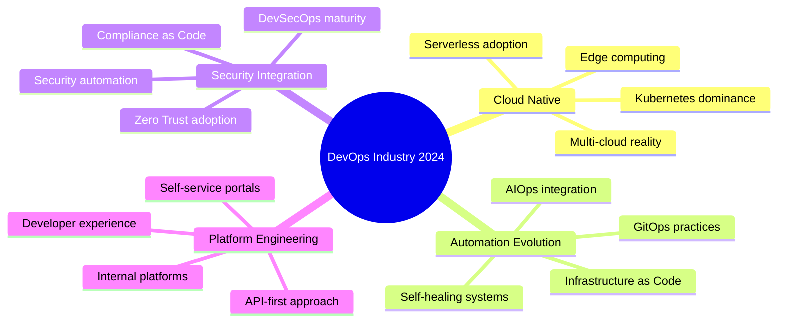

### Industry Statistics and Trends
1. **Market Growth**
   - DevOps market size: $10.4 billion (2024)
   - Expected growth: 20% CAGR
   - Cloud adoption: 85% of enterprises
   - Automation focus: 76% investment increase

2. **Skill Demands**
   - Cloud platforms: 89% requirement
   - Kubernetes: 78% job postings
   - Security automation: 67% increase
   - Platform engineering: 45% growth

3. **Salary Trends (Indian Market 2024)**
   - Entry Level: ₹4-8 LPA
   - Mid Level: ₹8-18 LPA
   - Senior Level: ₹18-35 LPA
   - Architect Level: ₹35-60+ LPA

## Comprehensive DevOps Career Paths

### Career Progression Framework
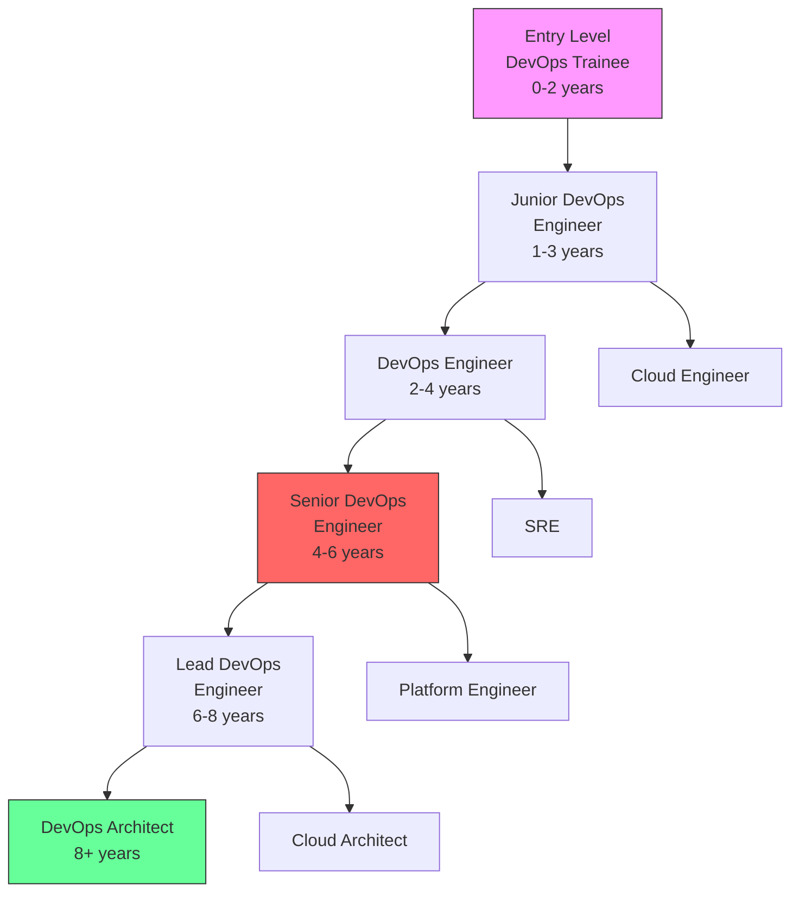

### Detailed Role Analysis and Requirements

#### 1. Entry Level DevOps Trainee (0-1 years)
- **Salary Range**: ₹3-5 LPA
- **Primary Focus**: Learning and adaptation
- **Technical Requirements**:
  * Basic Linux commands and administration
  * Fundamental Git operations
  * Basic scripting (Bash/Python)
  * Cloud fundamentals (AWS/Azure)
- **Daily Responsibilities**:
  * Monitoring system alerts
  * Basic troubleshooting
  * Documentation updates
  * Script maintenance
- **Learning Path**:
  * Linux certification (RHCSA)
  * Cloud fundamentals certification
  * Basic scripting courses
  * Git and GitHub basics
- **Real Example**: "In my first role, I started with managing Jenkins jobs and basic pipeline maintenance. Key learning was understanding production environments."

#### 2. Junior DevOps Engineer (1-3 years)
- **Salary Range**: ₹5-10 LPA
- **Technical Requirements**:
  * Strong Linux administration
  * Scripting proficiency
  * CI/CD pipeline management
  * Basic cloud services
  * Container basics
- **Responsibilities**:
  * Pipeline creation and maintenance
  * Infrastructure provisioning
  * Basic monitoring setup
  * Incident response level 1
- **Key Projects Handling**:
  * Small-scale deployments
  * Tool integration
  * Automation scripts
  * Monitoring setup
- **Growth Focus**:
  * Advanced cloud services
  * Container orchestration
  * Infrastructure as Code
  * Automation frameworks

#### 3. DevOps Engineer (2-4 years)
- **Salary Range**: ₹10-18 LPA
- **Technical Expertise**:
  * Advanced CI/CD
  * Kubernetes management
  * Infrastructure as Code
  * Cloud architecture
  * Security integration
- **Core Responsibilities**:
  * Architecture implementation
  * Security integration
  * Performance optimization
  * Team coordination
- **Project Scope**:
  * Multi-region deployments
  * High-availability setups
  * Disaster recovery
  * Cost optimization

#### 4. Senior DevOps Engineer (4-6 years) - Current Level
- **Salary Range**: ₹18-35 LPA
- **Technical Leadership**:
  * Architecture design
  * Multi-cloud strategy
  * Enterprise security
  * Performance engineering
  * Cost optimization
- **Team Responsibilities**:
  * Team leadership (8-10 members)
  * Technical mentoring
  * Project planning
  * Stakeholder management
- **Strategic Focus**:
  * Business alignment
  * Innovation drives
  * Process optimization
  * Risk management

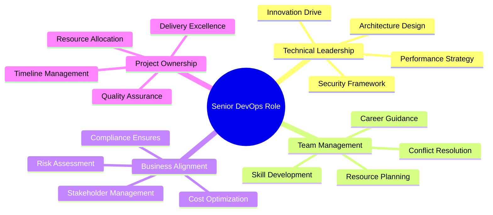

#### 5. Lead DevOps Engineer (6-8 years)
- **Salary Range**: ₹35-45 LPA
- **Strategic Leadership**:
  * Organization-wide strategy
  * Technology roadmap
  * Team building
  * Vendor management
- **Focus Areas**:
  * Enterprise architecture
  * Digital transformation
  * Innovation leadership
  * Business strategy

#### 6. DevOps Architect (8+ years)
- **Salary Range**: ₹45-60+ LPA
- **Enterprise Impact**:
  * Technology vision
  * Enterprise strategy
  * Industry leadership
  * Business transformation
- **Responsibilities**:
  * Enterprise architecture
  * Technology roadmap
  * Strategic planning
  * Executive communication

# DevOps in Industry: A Senior Engineer's Perspective (Part 2)

## Specialized DevOps Roles and Career Paths

### Site Reliability Engineering (SRE)
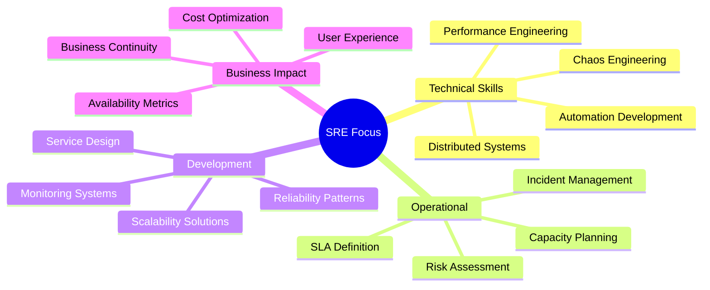

#### SRE Career Path
1. **Associate SRE (0-2 years)**
   - Salary: ₹6-12 LPA
   - Focus Areas:
     * System monitoring
     * Basic automation
     * Incident response
     * Performance metrics

2. **SRE Engineer (2-4 years)**
   - Salary: ₹12-20 LPA
   - Responsibilities:
     * Error budgeting
     * SLO definition
     * Automation development
     * Capacity planning

3. **Senior SRE (4+ years)**
   - Salary: ₹20-40 LPA
   - Advanced Focus:
     * Architecture design
     * Reliability strategy
     * Team leadership
     * Cross-functional alignment

### Platform Engineering
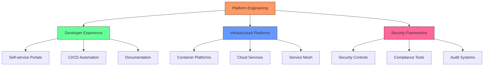

#### Platform Engineer Career Path
1. **Junior Platform Engineer**
   - Salary: ₹8-15 LPA
   - Key Skills:
     * Infrastructure automation
     * CI/CD pipelines
     * API development
     * Tool integration

2. **Senior Platform Engineer**
   - Salary: ₹15-35 LPA
   - Advanced Skills:
     * Platform architecture
     * Developer experience
     * Security integration
     * Performance optimization

## Industry-Specific DevOps Implementation

### Banking and Financial Services
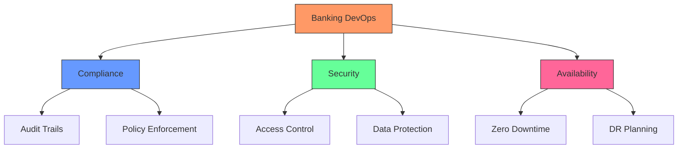

#### Real-World Example: Core Banking System
From my experience at Accenture:
1. **Initial State**
   - Weekend deployments only
   - Manual compliance checks
   - Limited automation
   - High deployment failures

2. **Transformation**
   - Automated compliance checks
   - Zero-downtime deployments
   - Continuous security scanning
   - Automated rollback capabilities

3. **Results**
   - Deployment time: 6 hours → 30 minutes
   - Zero security incidents
   - 99.99% availability
   - 70% cost reduction

### E-commerce Sector
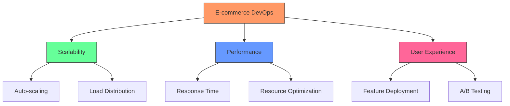

## Essential Skills Framework for 2024

### Technical Skills Matrix
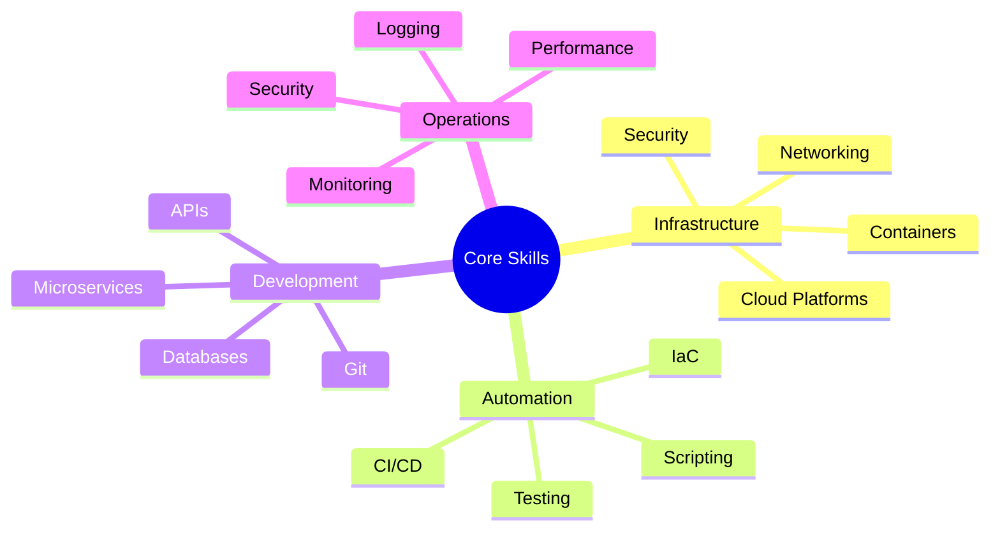

### Soft Skills Requirements
1. **Communication Skills**
   - Stakeholder management
   - Technical documentation
   - Team collaboration
   - Incident communication

2. **Problem-Solving**
   - Root cause analysis
   - Critical thinking
   - Innovation mindset
   - Decision making

3. **Leadership**
   - Team guidance
   - Project management
   - Conflict resolution
   - Mentoring

## Practical Career Development Guide

### First 6 Months Plan
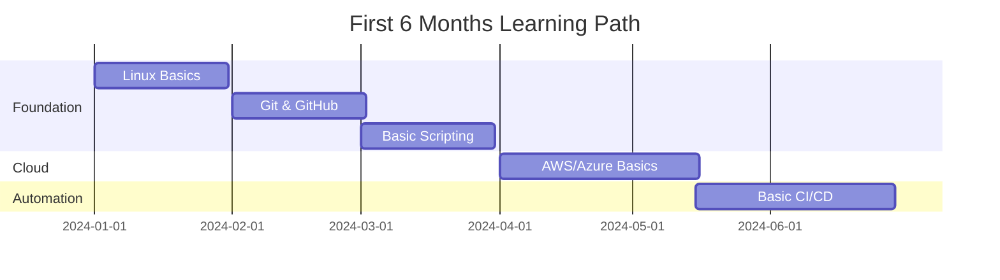

### Year 1-2 Development Path
1. **Technical Skills**
   - Cloud certification (AWS/Azure)
   - Container orchestration (Kubernetes)
   - Infrastructure as Code (Terraform)
   - CI/CD pipelines (Jenkins/Azure DevOps)

2. **Project Experience**
   - Personal projects portfolio
   - Open source contributions
   - Blog technical learnings
   - Network building

### Advanced Career Development (2-4 Years)
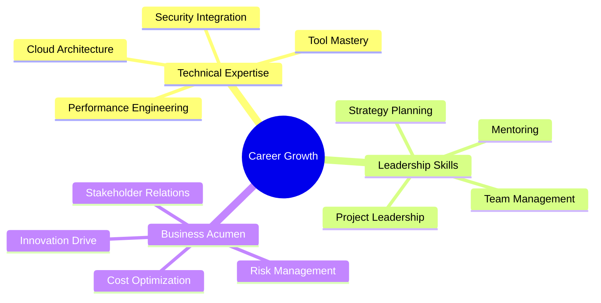

## Real-World Project Examples

### Project 1: E-commerce Platform Migration
From my experience at Accenture:

1. **Project Overview**
   - Migration from monolith to microservices
   - Team size: 12 members
   - Duration: 8 months
   - Budget: $1.2 million

2. **Technical Stack**
   - Kubernetes for orchestration
   - Azure cloud platform
   - Microservices architecture
   - Event-driven design

3. **Challenges & Solutions**
   - Data migration strategy
   - Zero-downtime requirement
   - Performance optimization
   - Team upskilling

### Project 2: Banking System Modernization
Real project insights:

1. **Scope**
   - Core banking system upgrade
   - Regulatory compliance
   - High availability requirement
   - Security enhancement

2. **Implementation**
   - CI/CD pipeline setup
   - Automated compliance checks
   - Security automation
   - Performance monitoring

## Industry Networking and Growth

### Community Engagement
1. **Technical Communities**
   - DevOps Days
   - Cloud Native Computing Foundation
   - Local tech meetups
   - Online forums

2. **Knowledge Sharing**
   - Technical blogging
   - Conference speaking
   - Mentoring programs
   - Open source contribution

## Future Trends and Preparation

### Emerging Technologies
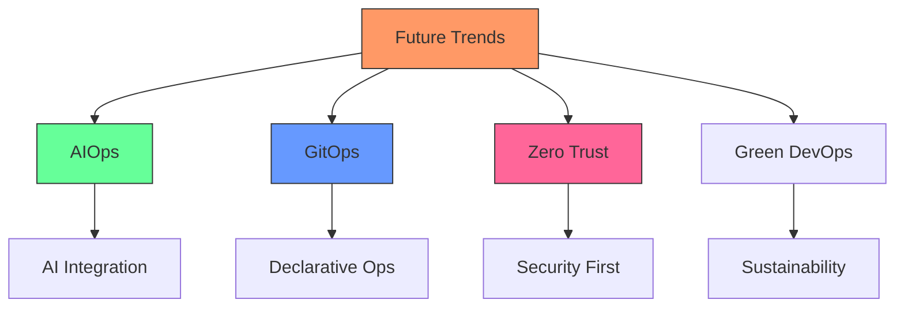

### Skill Evolution Focus
1. **Technical Evolution**
   - AI/ML integration
   - Advanced automation
   - Quantum computing readiness
   - Edge computing

2. **Business Evolution**
   - Digital transformation
   - Business metrics
   - Cost optimization
   - Risk management

## Additional Resources and Next Steps

### Learning Platforms
1. **Online Courses**
   - Coursera DevOps courses
   - Udemy practical training
   - Linux Academy
   - Cloud provider training

2. **Certification Paths**
   - AWS Certified DevOps Engineer
   - Azure DevOps Expert
   - Kubernetes Certification
   - Security certifications

### Practical Resources
1. **Hands-on Labs**
   - Cloud provider labs
   - Kubernetes playground
   - Docker practice
   - CI/CD sandboxes

2. **Community Resources**
   - GitHub repositories
   - Stack Overflow
   - DevOps forums
   - Technical blogs

Remember: DevOps is a journey of continuous learning and adaptation. Stay curious, keep practicing, and never stop learning.
