# DevOps Fundamentals in Production: Infrastructure, Tools, and Real-World Implementations

## Understanding the Industry Evolution of DevOps

### Historical Context and Evolution
1. **Traditional IT Operations (Pre-2000s)**
   - Waterfall methodology dominance
   - Separate teams for development and operations
   - Release cycles measured in months or years
   - Manual testing and deployment processes
   - Limited automation
   - High failure rates in production deployments

2. **Early Automation Phase (2000-2009)**
   - Introduction of basic scripting
   - Beginning of automated testing
   - Virtual machines becoming mainstream
   - Basic continuous integration practices
   - Weekly or monthly release cycles
   - Emergence of agile methodologies

3. **DevOps Emergence (2009-2015)**
   - Patrick Debois coins "DevOps" term
   - Integration of development and operations
   - Rise of configuration management
   - Cloud services becoming mainstream
   - Daily deployment capabilities
   - Infrastructure automation begins

4. **Modern DevOps Era (2015-Present)**
   - Containerization revolution
   - Microservices architecture
   - Cloud-native applications
   - Infrastructure as Code (IaC)
   - Continuous everything (CI/CD/CM)
   - AI/ML integration in operations

### The Business Impact of DevOps
1. **Financial Benefits**
   - Reduced operational costs
   - Faster time to market
   - Better resource utilization
   - Lower failure rates
   - Improved ROI on technology investments

2. **Organizational Benefits**
   - Better team collaboration
   - Improved employee satisfaction
   - Reduced burnout
   - Higher innovation rates
   - Better knowledge sharing

3. **Customer Benefits**
   - Faster feature delivery
   - More stable applications
   - Better user experience
   - Quicker bug fixes
   - More frequent updates

## Real-World Infrastructure Deep Dive

### Production Environment Anatomy

#### 1. Frontend Infrastructure
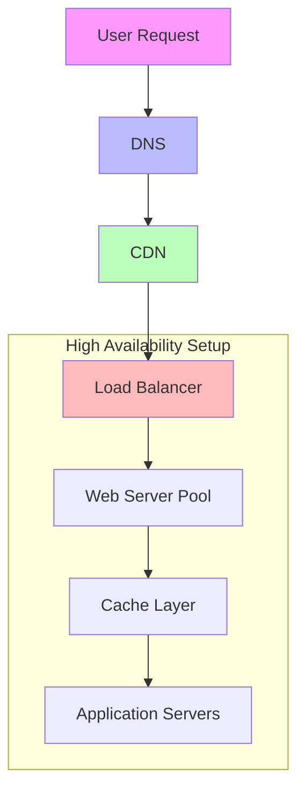

**Real-World Scenario: E-commerce Platform Infrastructure**
- Primary Components:
  * Global DNS with GeoDNS capabilities
  * Multi-region CDN setup
  * Layer 4 and Layer 7 load balancers
  * Auto-scaling web server groups
  * Distributed caching system
  * Microservices-based application layer

#### 2. Backend Infrastructure
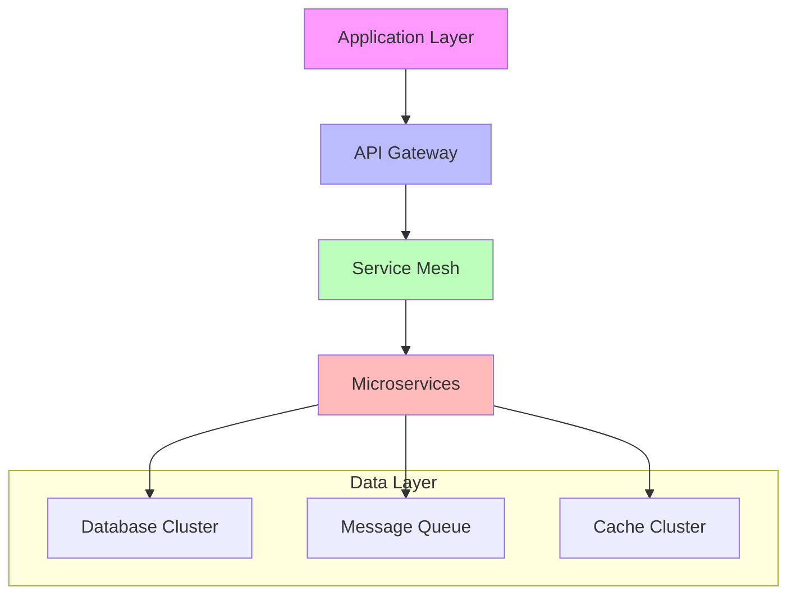

**Detailed Component Analysis:**

1. **Load Balancers In-Depth**
   - Types of Load Balancers:
     * Layer 4 (Transport Layer)
       - TCP/UDP load balancing
       - Faster processing
       - Less intelligence
     * Layer 7 (Application Layer)
       - Content-based routing
       - SSL termination
       - Advanced request handling

   Real-World Example: "The Flash Sale Scenario"
   * Challenge: Handle 100,000 concurrent users
   * Solution Implementation:
     - Multiple load balancer layers
     - Geographic distribution
     - Rate limiting implementation
     - Queue-based access control

2. **Application Servers Deep Dive**
   - Server Types:
     * Web Servers
     * Application Servers
     * Processing Servers
     * Caching Servers

   Deployment Patterns:
   ```mermaid
   graph TD
       A[Blue-Green Deployment] --> B[Active-Active]
       A --> C[Active-Passive]
       B --> D[Rolling Updates]
       C --> E[Canary Releases]
       style A fill:#f96,stroke:#333
       style D fill:#6f9,stroke:#333
       style E fill:#6f9,stroke:#333
   ```

3. **Database Infrastructure**
   - Multi-Region Setup:
     * Primary Database
     * Read Replicas
     * Backup Systems
     * Disaster Recovery

   High Availability Pattern:
   ```mermaid
   flowchart LR
       A[Primary DB] --> B[Sync Replica]
       A --> C[Async Replica 1]
       A --> D[Async Replica 2]
       
       subgraph "Region 1"
       A
       B
       end
       
       subgraph "Region 2"
       C
       end
       
       subgraph "Region 3"
       D
       end
   ```

## Production Monitoring and Observability

### 1. Comprehensive Monitoring Strategy

#### Infrastructure Monitoring
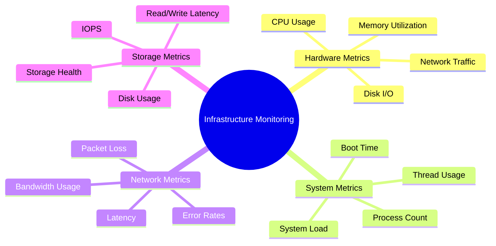

#### Application Monitoring
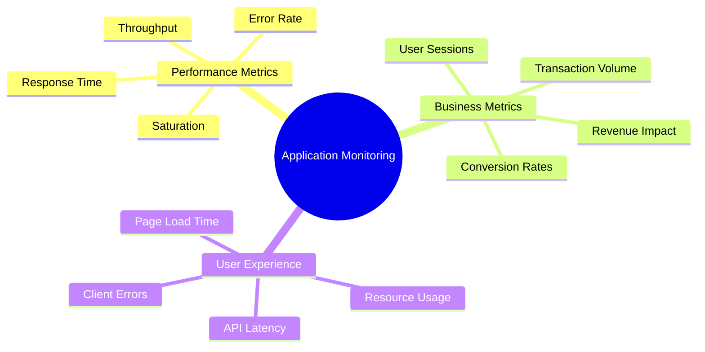

### 2. Real-World Alert Management

#### Alert Priority Levels
1. **P0 - Critical**
   - Complete service outage
   - Data loss risk
   - Security breach
   - Revenue impact

2. **P1 - High**
   - Partial service degradation
   - Performance issues
   - Capacity warnings
   - Security warnings

3. **P2 - Medium**
   - Non-critical component failure
   - Warning thresholds reached
   - Minor functionality issues

4. **P3 - Low**
   - Routine maintenance needed
   - Non-impacting issues
   - Documentation updates

#### Alert Response Workflow
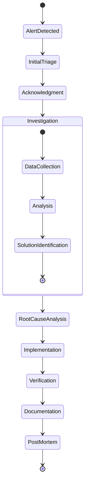

## Disaster Recovery and Business Continuity

### 1. Disaster Recovery Strategies

#### RPO and RTO Planning
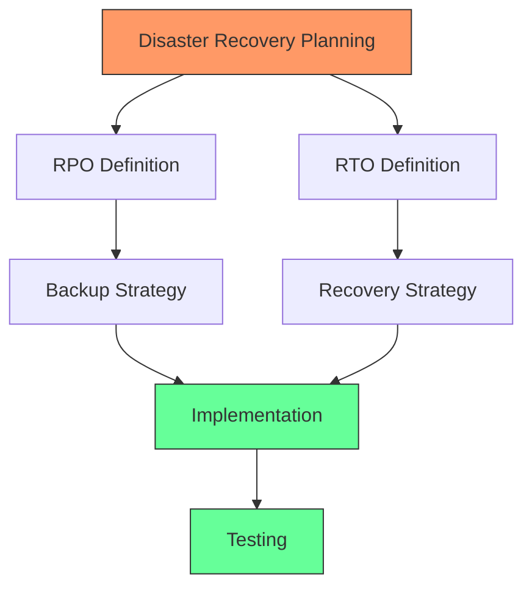

#### Real-World DR Scenarios

1. **Database Corruption**
   - Immediate Actions:
     * Service isolation
     * Backup validation
     * Point-in-time recovery
     * Data consistency checks

2. **Network Outage**
   - Response Plan:
     * Failover to secondary region
     * DNS updates
     * Load balancer reconfiguration
     * Client communication

3. **Application Failure**
   - Recovery Steps:
     * Version rollback
     * Configuration validation
     * Data state verification
     * Service health checks

### 2. High Availability Patterns

#### Active-Active Setup
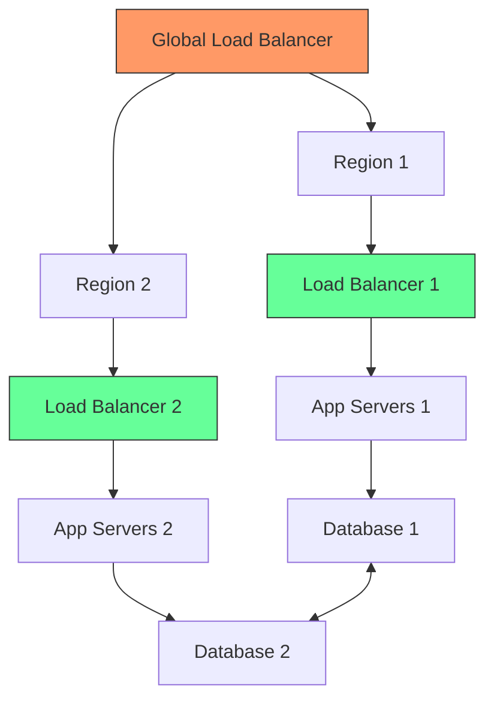

# DevOps Fundamentals in Production: Part 2

## Security in Production Environments

### 1. Security Layers in Modern Infrastructure

#### Network Security Architecture
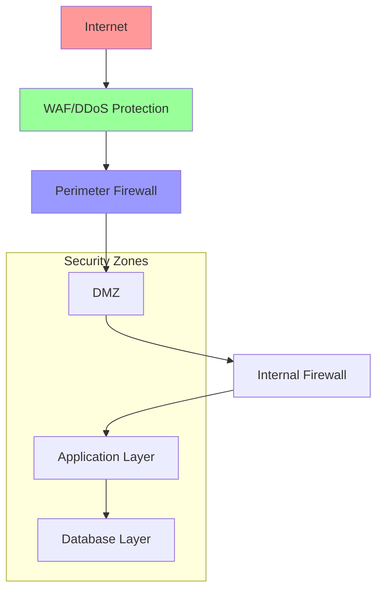

#### Security Components Deep Dive

1. **Edge Security**
   - DDoS Protection
     * Volume-based attacks
     * Protocol attacks
     * Application layer attacks
   - Web Application Firewall (WAF)
     * SQL injection prevention
     * Cross-site scripting protection
     * Request rate limiting
     * Geographic blocking

2. **Application Security**
   - Authentication Systems
     * Multi-factor authentication
     * Single sign-on
     * Token-based auth
     * Session management
   - Authorization Framework
     * Role-based access control
     * Attribute-based access control
     * Policy enforcement points

3. **Data Security**
   - Encryption Layers
     * Data at rest
     * Data in transit
     * Key management
   - Data Classification
     * Public data
     * Internal data
     * Confidential data
     * Restricted data

### 2. Security Incident Response

#### Incident Management Workflow
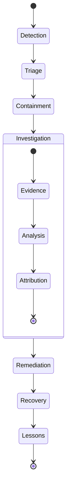

## Performance Optimization and Scaling

### 1. Performance Optimization Strategies

#### Application Performance Matrix
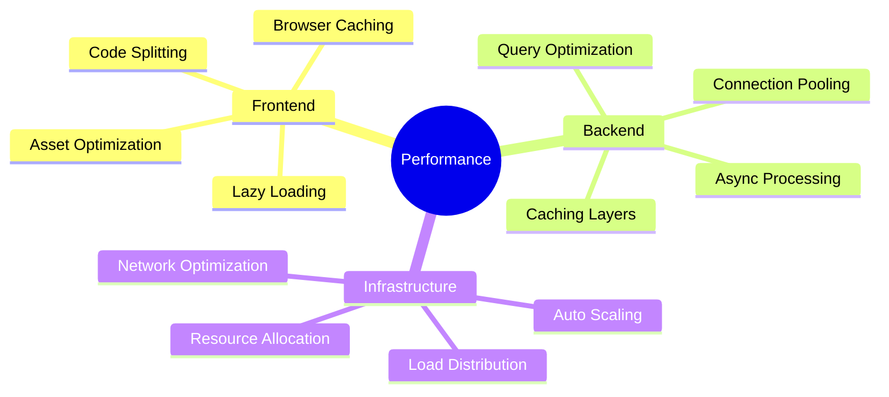

#### Real-World Performance Scenarios

1. **High-Load Web Application**
   - Initial State:
     * 5-second page load
     * High server CPU usage
     * Database bottlenecks
     * Frequent timeouts

   - Optimization Steps:
     * Implemented CDN
     * Added caching layers
     * Optimized database queries
     * Scaled horizontally
     * Implemented request queuing

   - Final Results:
     * Sub-second page load
     * 70% reduced CPU usage
     * Zero timeouts
     * 99.99% uptime

2. **E-commerce Platform Optimization**
   ```mermaid
   graph TD
       A[Initial Analysis] --> B[Performance Bottlenecks]
       B --> C[Database Optimization]
       B --> D[Application Caching]
       B --> E[Frontend Optimization]
       C --> F[Results Measurement]
       D --> F
       E --> F
       style A fill:#f96,stroke:#333
       style F fill:#6f9,stroke:#333
   ```

### 2. Scaling Strategies

#### Horizontal vs Vertical Scaling
1. **Vertical Scaling (Scale Up)**
   - When to Use:
     * Database servers
     * Cache servers
     * CPU-intensive workloads
   - Limitations:
     * Hardware limits
     * Cost implications
     * Single point of failure

2. **Horizontal Scaling (Scale Out)**
   - Implementation:
     * Load balancer configuration
     * Session management
     * Data consistency
     * Cache synchronization

#### Auto-scaling Implementation
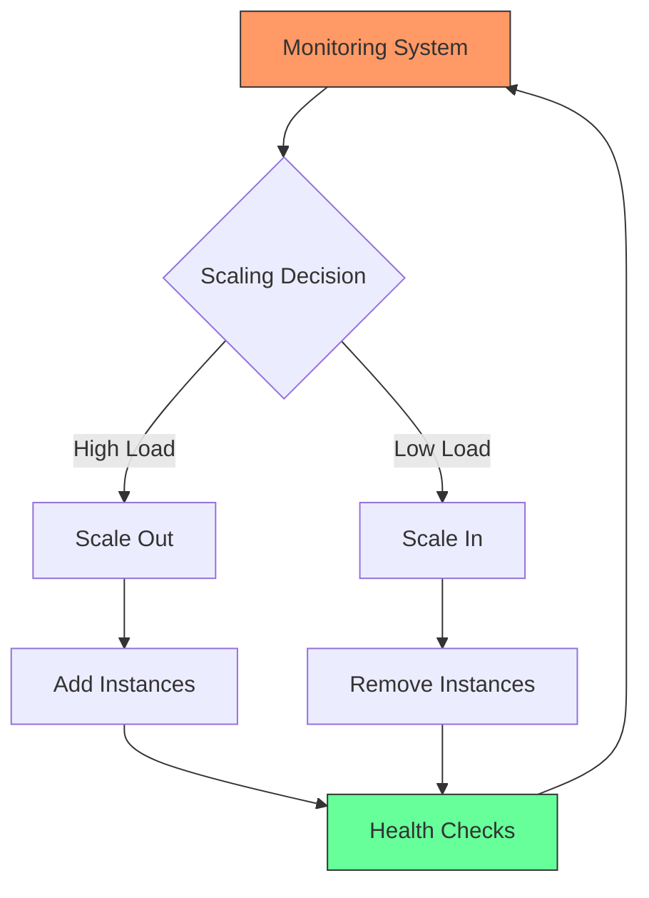

## DevOps Tools and Automation

### 1. CI/CD Pipeline Components

#### Complete Pipeline Architecture
```mermaid
flowchart LR
    A[Source Control] --> B[Build]
    B --> C[Unit Tests]
    C --> D[Code Analysis]
    D --> E[Security Scan]
    E --> F[Artifact Creation]
    F --> G[Deployment]
    G --> H[Integration Tests]
    H --> I[Performance Tests]
    I --> J[Production]
    
    style A fill:#f96
    style F fill:#6f9
    style J fill:#96f
```

#### Pipeline Stages Detailed Analysis

1. **Source Control Management**
   - Branching Strategies:
     * GitFlow
     * Trunk-based development
     * Feature branching
   - Code Review Process:
     * Automated checks
     * Peer review
     * Documentation review

2. **Build Process**
   - Build Environment:
     * Containerized builds
     * Dependencies management
     * Version control
   - Build Optimization:
     * Parallel execution
     * Caching strategies
     * Resource allocation

3. **Testing Phases**
   - Unit Testing:
     * Code coverage
     * Mock services
     * Test automation
   - Integration Testing:
     * API testing
     * Service integration
     * End-to-end testing

### 2. Monitoring and Logging Implementation

#### Comprehensive Monitoring Stack
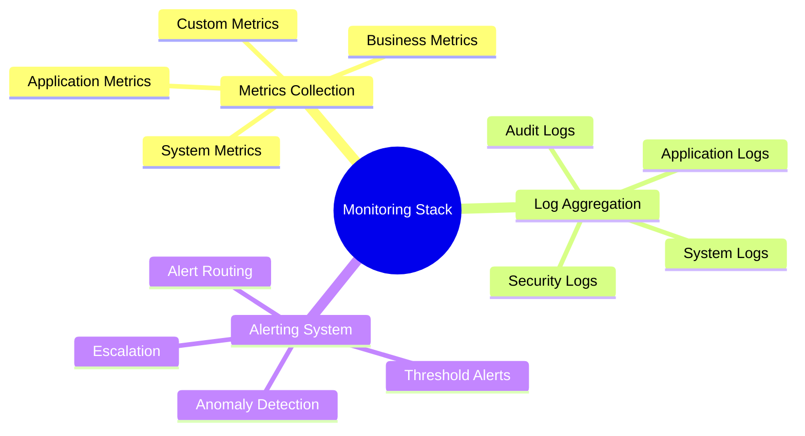

#### Real-World Monitoring Scenario

1. **E-commerce Platform Monitoring**
   - Key Metrics:
     * Transaction success rate
     * Cart abandonment
     * Payment processing time
     * Inventory sync status
   - Alert Configuration:
     * Payment failures
     * High error rates
     * System saturation
     * Security incidents

## Best Practices and Industry Standards

### 1. Production Deployment Best Practices

#### Deployment Strategies
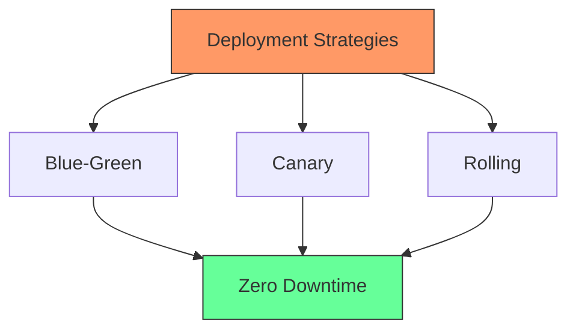

1. **Blue-Green Deployment**
   - Implementation Steps:
     * Environment preparation
     * Data synchronization
     * Traffic routing
     * Rollback planning

2. **Canary Deployment**
   - Strategy Components:
     * Traffic splitting
     * Metrics monitoring
     * Gradual rollout
     * Automated rollback

### 2. Documentation and Knowledge Management

#### Documentation Types
1. **Technical Documentation**
   - System architecture
   - Deployment procedures
   - Troubleshooting guides
   - Recovery procedures

2. **Operational Documentation**
   - Runbooks
   - Incident response plans
   - Escalation procedures
   - Change management

3. **Team Documentation**
   - Best practices
   - Lessons learned
   - Team protocols
   - Training materials

## Future Trends and Emerging Technologies

### 1. DevOps Evolution
- AIOps and ML Integration
- Serverless Architecture
- Edge Computing
- GitOps
- DevSecOps Maturity

### 2. Skill Development Focus Areas
- Cloud Native Technologies
- Security Automation
- Infrastructure as Code
- Observability Platforms
- Performance Engineering

## Practical Exercises and Case Studies

[Include various hands-on scenarios and real-world case studies for students to analyze and discuss]

## Additional Resources and References
1. Industry Standard Documentation
2. Tool-specific Guides
3. Community Forums and Resources
4. Training Platforms
5. Certification Paths
