# Azure DevOps: From Theory to Production - A Senior Engineer's Perspective

## Introduction: Why Azure DevOps?

When I started my journey at Accenture, the most common question I encountered was: "Why do enterprises choose Azure DevOps over other platforms?" Having worked with multiple platforms across different organizations, I can now explain the compelling reasons behind Azure's dominance in the enterprise space.

### The Enterprise Advantage

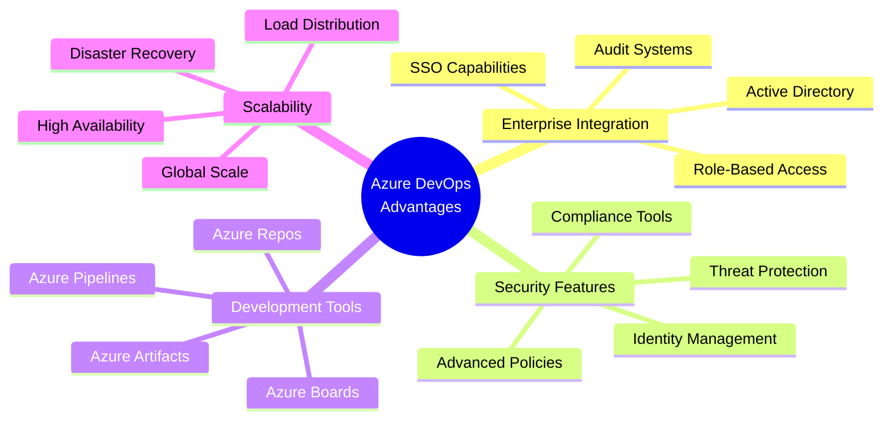

Let me share a real scenario from my banking sector experience:

We had to manage a development team of 5000+ developers across three continents with different access levels and compliance requirements. The challenge wasn't just about managing code – it was about:
- Ensuring regulatory compliance
- Maintaining security standards
- Managing access controls
- Tracking every change for audits
- Enabling collaboration
- Maintaining performance

## Understanding Azure DevOps Components

### 1. Azure Boards: Project Management Reimagined

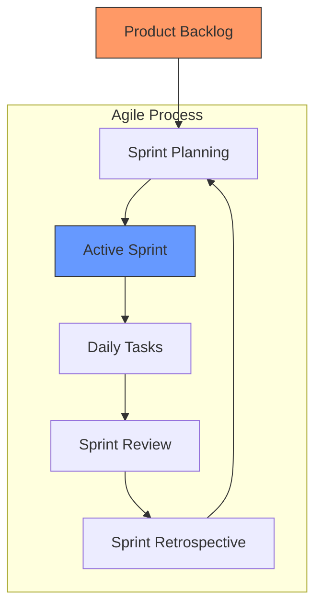

Real-World Application:
In my current role, we've customized Azure Boards to:
- Track features across 20 teams
- Automate status updates
- Generate compliance reports
- Integrate with customer systems

### 2. Azure Pipelines: The Deployment Journey

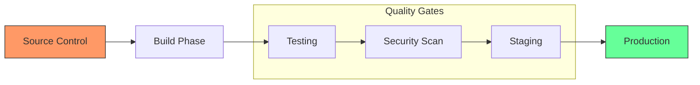

From my experience implementing pipelines for financial institutions:

1. Build Phase:
   - Multiple environment configurations
   - Dependency management
   - Version control
   - Build optimization

2. Testing Phase:
   - Automated testing
   - Security scanning
   - Performance testing
   - Compliance checks

3. Deployment Phase:
   - Blue-green deployment
   - Canary releases
   - Rollback mechanisms
   - Health monitoring

### 3. Monitoring and Observability

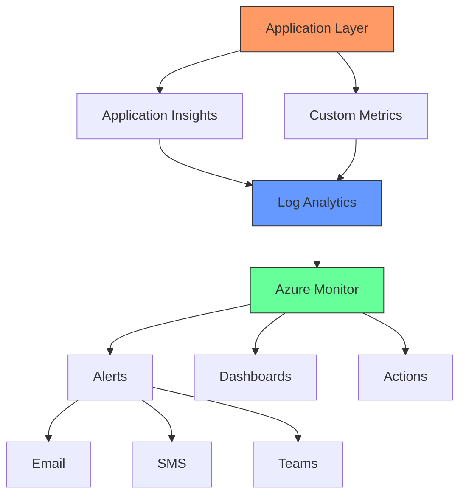

Best Practices from Production:

1. Monitoring Strategy:
   - Real-time metrics
   - Historical analysis
   - Predictive alerts
   - Business KPIs

2. Alert Management:
   - Severity levels
   - Escalation paths
   - On-call rotations
   - Automated responses

## Enterprise Security Implementation

### Multi-Layer Security Approach

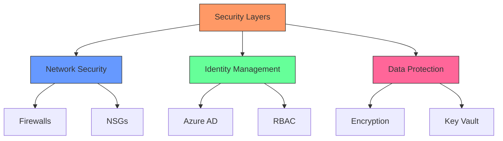

Based on my experience securing enterprise environments:

1. Network Security:
   - Zero-trust architecture
   - Network segmentation
   - DDoS protection
   - Traffic monitoring

2. Identity Protection:
   - Multi-factor authentication
   - Conditional access
   - Just-in-time access
   - Session management

# Azure DevOps: From Theory to Production - A Senior Engineer's Perspective (Part 2)

## Disaster Recovery and Business Continuity

### Multi-Region Architecture Strategy

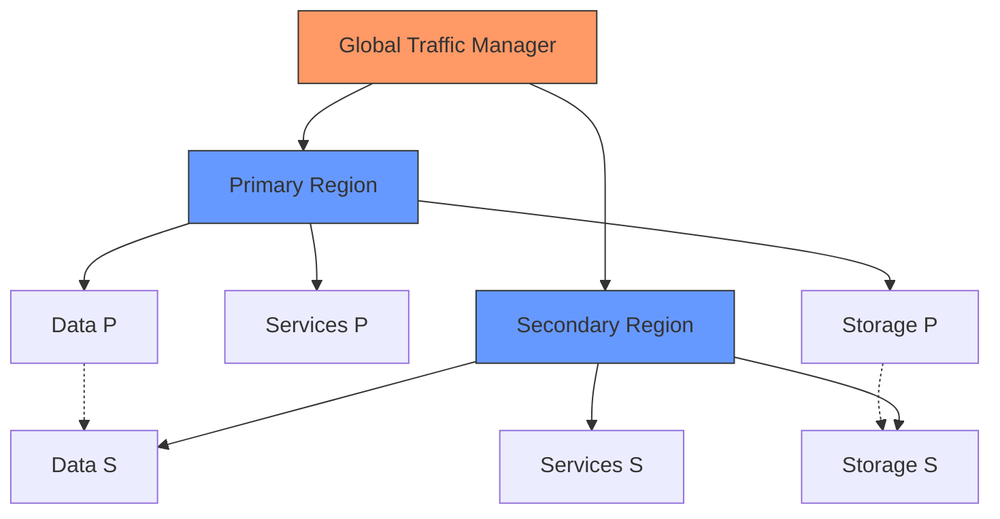

From my experience implementing DR for financial institutions:

1. **Recovery Strategy Levels**
   - Hot Standby
     * Real-time replication
     * Instant failover capability
     * Higher cost but minimal downtime
   
   - Warm Standby
     * Periodic synchronization
     * Reduced costs
     * Acceptable recovery time
   
   - Cold Standby
     * Backup-based recovery
     * Lowest cost
     * Longer recovery time

2. **Business Impact Analysis**
   - Critical Systems Identification
     * Payment processing
     * User authentication
     * Core business functions
   
   - Recovery Objectives
     * Recovery Time Objective (RTO)
     * Recovery Point Objective (RPO)
     * Service Level Agreements (SLA)

### Incident Response Framework

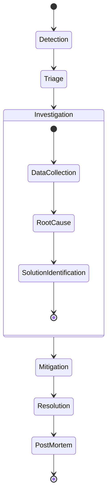

Real-world Incident Management Process:

1. **Detection Phase**
   - Automated monitoring
   - User reports
   - System alerts
   - Performance degradation

2. **Triage Process**
   - Impact assessment
   - Priority assignment
   - Team mobilization
   - Initial communication

3. **Investigation Approach**
   - Log analysis
   - System diagnostics
   - Pattern recognition
   - Timeline construction

## Cost Optimization and Resource Management

### Resource Optimization Framework

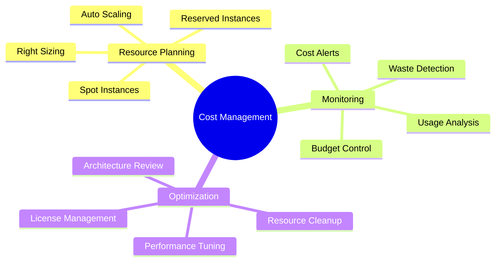

Learnings from Large-Scale Implementations:

1. **Cost Control Strategies**
   - Resource Tagging
     * Business unit allocation
     * Project tracking
     * Environment classification
     * Owner identification

   - Automation Rules
     * Auto-shutdown of dev environments
     * Scale-down during off-hours
     * Unused resource cleanup
     * Storage tier optimization

2. **Budget Management**
   - Department Allocations
   - Alert Thresholds
   - Spending Limits
   - Usage Reporting

## Modern DevOps Practices and AI Integration

### AIOps Implementation

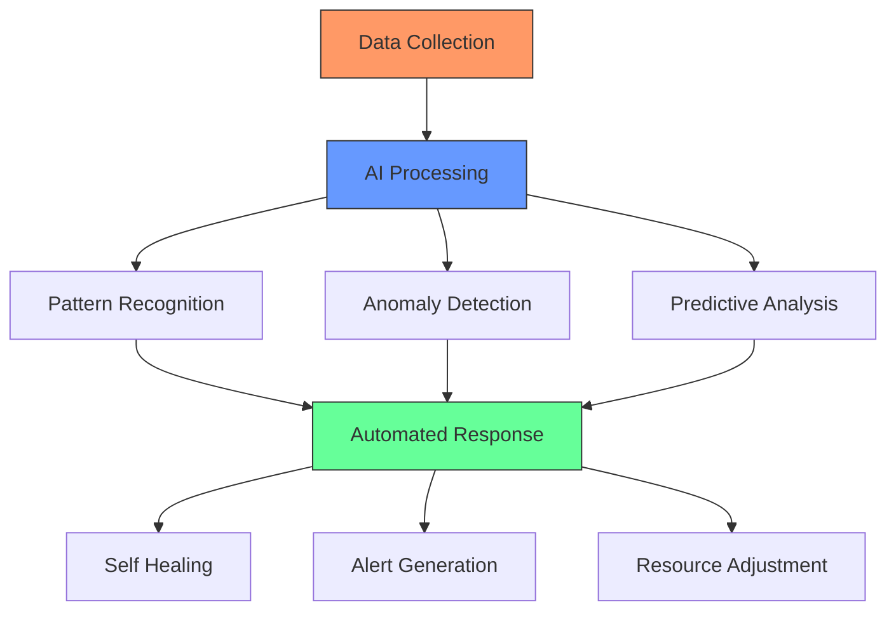

Real Implementation Examples:

1. **Predictive Monitoring**
   - Performance prediction
   - Capacity planning
   - Failure prevention
   - Resource optimization

2. **Automated Response**
   - Self-healing systems
   - Auto-scaling
   - Problem resolution
   - Performance tuning

3. **Machine Learning Integration**
   - Log analysis
   - Security threat detection
   - Performance optimization
   - User behavior analysis

### Platform Engineering Evolution

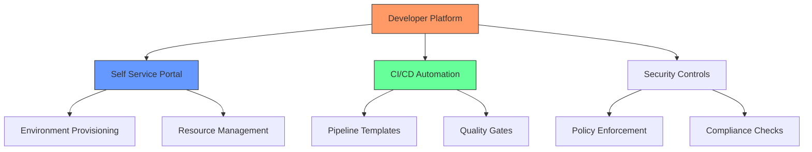

Key Components from My Experience:

1. **Developer Experience**
   - Self-service capabilities
   - Automated provisioning
   - Standard templates
   - Documentation

2. **Platform Features**
   - Environment management
   - Resource provisioning
   - Security enforcement
   - Monitoring integration

## Future Trends and Industry Direction

### Emerging Technologies

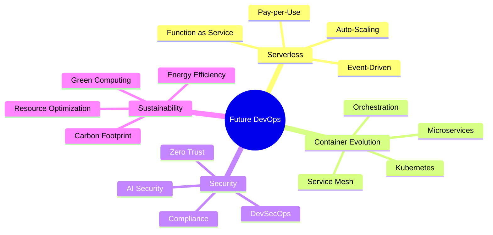

Based on Industry Trends and Experience:

1. **Evolution of DevOps**
   - Increased automation
   - AI/ML integration
   - Security focus
   - Platform engineering

2. **Skill Requirements**
   - Cloud expertise
   - Security knowledge
   - AI/ML understanding
   - Business acumen

## Best Practices and Recommendations

1. **Architecture Principles**
   - Design for failure
   - Scale horizontally
   - Automate everything
   - Monitor extensively

2. **Implementation Strategy**
   - Start small
   - Iterate frequently
   - Measure everything
   - Document thoroughly

3. **Team Development**
   - Cross-training
   - Knowledge sharing
   - Continuous learning
   - Collaboration focus

Remember: Success in Azure DevOps is not just about technical implementation – it's about creating a culture of continuous improvement, automation, and collaboration.
