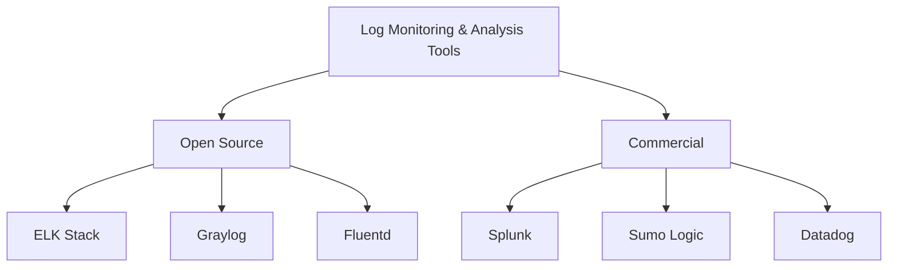

# 📊 Unit 5: Log Monitoring and Analysis

## 1. Overview 🔍

Log monitoring and analysis are crucial components of maintaining and troubleshooting IT systems. They involve collecting, storing, and examining log data generated by various software applications, systems, and network devices.

## 2. Objectives of Log Monitoring 🎯

- Real-time issue detection
- Security threat identification
- Performance optimization
- Compliance and auditing
- Capacity planning
- User behavior analysis

💡 **Fun Fact:** Did you know that a single server can generate millions of log entries per day? That's a lot of data to sift through!

## 3. Metrics in Log Monitoring 📈

Common metrics include:
- Error rates
- Response times
- Resource utilization
- User activity
- Security events

## 4. Log Monitoring vs. Log Analysis 🆚

Let's break down the differences:

| Log Monitoring | Log Analysis |
|----------------|--------------|
| Real-time observation | In-depth examination |
| Focuses on current events | Focuses on historical data |
| Alerts on predefined conditions | Uncovers patterns and trends |
| Reactive approach | Proactive approach |

## 5. Log Analysis Techniques 🧠

1. **Pattern Recognition:** Identifying recurring events or sequences
2. **Correlation Analysis:** Connecting related events across different logs
3. **Anomaly Detection:** Identifying unusual patterns or behaviors
4. **Statistical Analysis:** Using statistical methods to understand log data
5. **Machine Learning:** Applying AI to automate log analysis

🤖 **AI Fact:** Machine learning algorithms can process millions of log entries in seconds, identifying patterns that would take humans days or weeks to discover!

## 6. Purpose and Benefits of Log Analysis 🌟

- **Improved Troubleshooting:** Quickly identify the root cause of issues
- **Enhanced Security:** Detect and respond to security threats faster
- **Better Performance:** Optimize system and application performance
- **Informed Decision Making:** Data-driven insights for IT operations
- **Regulatory Compliance:** Meet audit and compliance requirements

## 7. Log Analysis Best Practices 👍

1. **Centralize Log Collection:** Store all logs in a central location
2. **Standardize Log Formats:** Use consistent formats across systems
3. **Implement Real-time Monitoring:** Set up alerts for critical events
4. **Retain Historical Data:** Keep logs for an appropriate period
5. **Use Visualization Tools:** Create dashboards for easy data interpretation
6. **Automate Where Possible:** Use tools to automate routine analysis tasks
7. **Regular Review and Tuning:** Continuously improve your log analysis process

🔑 **Key Insight:** Regular review of your log analysis process can lead to a 30% reduction in mean time to resolution (MTTR) for IT incidents!

## 8. Tools Overview 🛠️

Here's a diagram showcasing some popular log monitoring and analysis tools:

Let's briefly discuss each:

1. **ELK Stack:** Elasticsearch, Logstash, and Kibana - powerful open-source combo
2. **Graylog:** Open-source log management with a user-friendly interface
3. **Fluentd:** Open-source data collector for unified logging layer
4. **Splunk:** Enterprise-grade solution with advanced analytics capabilities
5. **Sumo Logic:** Cloud-native, machine data analytics service
6. **Datadog:** Cloud monitoring and analytics platform with log management features

🚀 **Fun Fact:** The ELK Stack processes billions of events per day for companies like Netflix, Facebook, and Microsoft!

## 9. Conclusion

Log monitoring and analysis are essential skills for any DevOps professional. By mastering these techniques and tools, you'll be well-equipped to maintain robust, secure, and high-performing systems. Remember, the key to successful log analysis is not just collecting data, but deriving actionable insights from it!

Happy logging! 🎉📝
