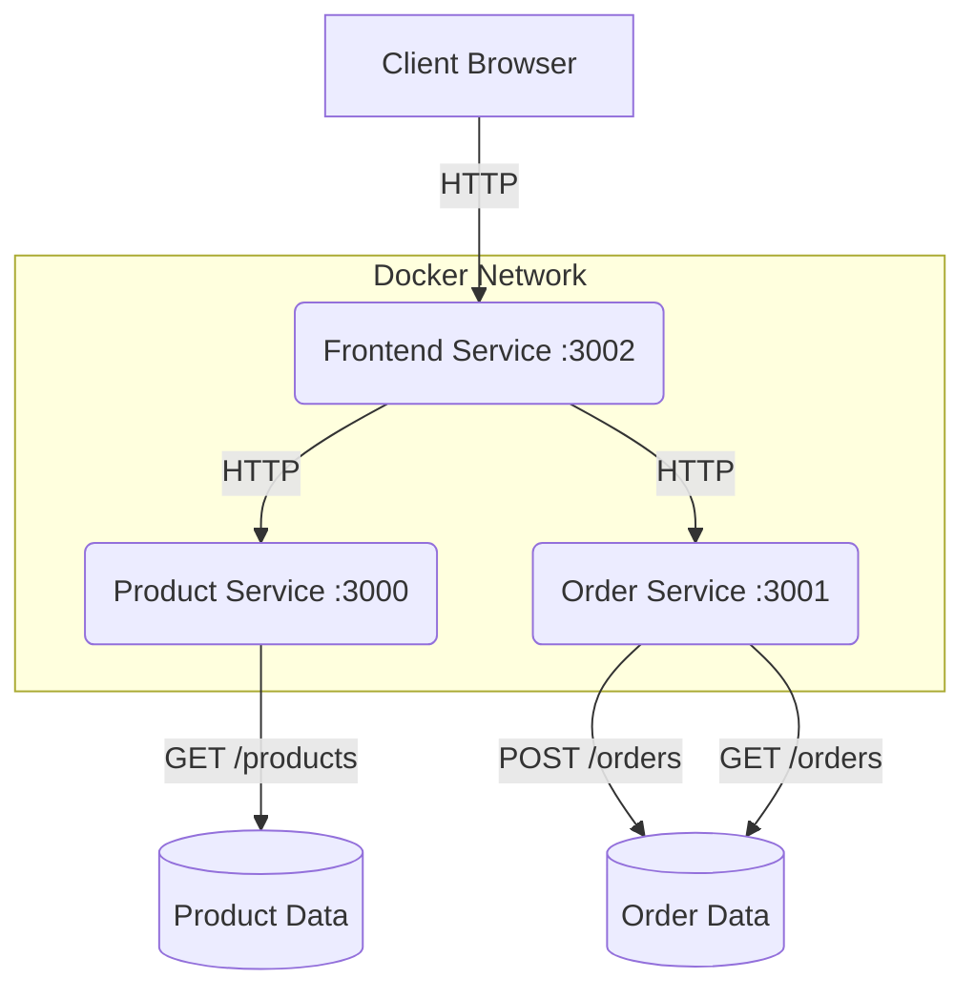

# Node.js Microservices with Docker - Lab Guide for Beginners

## Introduction
Welcome to this hands-on lab guide on building microservices with Node.js and Docker! This guide is designed for B.Tech final year students who are new to microservices architecture and containerization. By the end of this 2-3 hour laboratory session, you'll have created a small but functional e-commerce application using microservices, all running in Docker containers.

### What are Microservices?
Microservices is an architectural style that structures an application as a collection of small, loosely coupled services. Each service is focused on doing one thing well, runs in its own process, and communicates with other services through well-defined APIs.

### Why Docker?
Docker is a platform for developing, shipping, and running applications in containers. Containers are lightweight, standalone, executable packages that include everything needed to run a piece of software, including the code, runtime, system tools, libraries, and settings.

## Prerequisites
- Docker Desktop installed on your Windows PC (version 20.10.0 or later)
- Node.js installed on your local machine (version 14.x or later)
- Basic knowledge of JavaScript and Express.js
- Familiarity with RESTful APIs
- Text editor (e.g., Visual Studio Code)

## Project Overview
Our e-commerce application will consist of the following microservices:
1. Product Service: Manages product information
2. Order Service: Handles order processing
3. Frontend Service: Serves the user interface and integrates the other services



## Step 1: Set Up Project Structure (15 minutes)

To quickly set up the project structure, you can use the following Windows batch script. This script will create all the necessary directories and empty files for our project.

1. Open a text editor and create a new file named `setup_project.bat`.
2. Copy and paste the following content into the file:

```batch
@echo off

REM Create main project directory
mkdir ecommerce-microservices
cd ecommerce-microservices

REM Create product-service structure
mkdir product-service
mkdir product-service\src
type nul > product-service\src\index.js
type nul > product-service\package.json
type nul > product-service\Dockerfile

REM Create order-service structure
mkdir order-service
mkdir order-service\src
type nul > order-service\src\index.js
type nul > order-service\package.json
type nul > order-service\Dockerfile

REM Create frontend-service structure
mkdir frontend-service
mkdir frontend-service\src
mkdir frontend-service\src\public
type nul > frontend-service\src\index.js
type nul > frontend-service\src\public\index.html
type nul > frontend-service\package.json
type nul > frontend-service\Dockerfile

REM Create docker-compose.yml in the root directory
type nul > docker-compose.yml

echo Project structure created successfully!
```

3. Save the file and close the text editor.
4. Open a Command Prompt (cmd) window.
5. Navigate to the directory where you saved the `setup_project.bat` file.
6. Run the script by typing its name:

```
setup_project.bat
```

This script will create the following directory structure:

```
ecommerce-microservices/
├── product-service/
│   ├── src/
│   │   └── index.js
│   ├── package.json
│   └── Dockerfile
├── order-service/
│   ├── src/
│   │   └── index.js
│   ├── package.json
│   └── Dockerfile
├── frontend-service/
│   ├── src/
│   │   ├── index.js
│   │   └── public/
│   │       └── index.html
│   ├── package.json
│   └── Dockerfile
└── docker-compose.yml
```

Now that we have our project structure set up, let's move on to implementing each service.

## Step 2: Implement Product Service (30 minutes)

1. In `product-service/src/index.js`, create an Express app:

```javascript
const express = require('express');
const app = express();
const PORT = 3000;

// In-memory product database
const products = [
    { id: 1, name: "Laptop", price: 999.99 },
    { id: 2, name: "Smartphone", price: 499.99 },
    { id: 3, name: "Headphones", price: 99.99 }
];

app.use(express.json());

app.get('/products', (req, res) => {
    res.json(products);
});

app.listen(PORT, () => {
    console.log(`Product service listening at http://localhost:${PORT}`);
});
```

2. Update `product-service/package.json`:

```json
{
  "name": "product-service",
  "version": "1.0.0",
  "main": "src/index.js",
  "dependencies": {
    "express": "^4.17.1"
  },
  "scripts": {
    "start": "node src/index.js"
  }
}
```

3. Update `product-service/Dockerfile`:

```dockerfile
FROM node:14
WORKDIR /app
COPY package*.json ./
RUN npm install
COPY . .
EXPOSE 3000
CMD ["npm", "start"]
```

## Step 3: Implement Order Service (30 minutes)

1. In `order-service/src/index.js`, create an Express app:

```javascript
const express = require('express');
const app = express();
const PORT = 3001;

app.use(express.json());

// In-memory order database
let orders = [];

app.post('/orders', (req, res) => {
    const order = {
        id: orders.length + 1,
        ...req.body
    };
    orders.push(order);
    res.status(201).json(order);
});

app.get('/orders', (req, res) => {
    res.json(orders);
});

app.listen(PORT, () => {
    console.log(`Order service listening at http://localhost:${PORT}`);
});
```

2. Update `order-service/package.json`:

```json
{
  "name": "order-service",
  "version": "1.0.0",
  "main": "src/index.js",
  "dependencies": {
    "express": "^4.17.1"
  },
  "scripts": {
    "start": "node src/index.js"
  }
}
```

3. Update `order-service/Dockerfile`:

```dockerfile
FROM node:14
WORKDIR /app
COPY package*.json ./
RUN npm install
COPY . .
EXPOSE 3001
CMD ["npm", "start"]
```

## Step 4: Implement Frontend Service (40 minutes)

1. In `frontend-service/src/index.js`, create an Express app:

```javascript
const express = require('express');
const path = require('path');
const axios = require('axios');
const app = express();
const PORT = 3002;

app.use(express.json());
app.use(express.static(path.join(__dirname, 'public')));

app.get('/api/products', async (req, res) => {
    try {
        const response = await axios.get('http://product-service:3000/products');
        res.json(response.data);
    } catch (error) {
        res.status(500).json({ error: 'Error fetching products' });
    }
});

app.post('/api/orders', async (req, res) => {
    try {
        const response = await axios.post('http://order-service:3001/orders', req.body);
        res.status(201).json(response.data);
    } catch (error) {
        res.status(500).json({ error: 'Error creating order' });
    }
});

app.listen(PORT, () => {
    console.log(`Frontend service listening at http://localhost:${PORT}`);
});
```

2. Update `frontend-service/src/public/index.html`:

```html
<!DOCTYPE html>
<html lang="en">
<head>
    <meta charset="UTF-8">
    <meta name="viewport" content="width=device-width, initial-scale=1.0">
    <title>E-commerce Microservices Demo</title>
</head>
<body>
    <div id="app">
        <h1>Product List</h1>
        <ul id="productList"></ul>
        <h2>Cart</h2>
        <ul id="cart"></ul>
        <button id="placeOrder" disabled>Place Order</button>
        <div id="orderStatus"></div>
    </div>
    <script>
        const productList = document.getElementById('productList');
        const cart = document.getElementById('cart');
        const placeOrderBtn = document.getElementById('placeOrder');
        const orderStatus = document.getElementById('orderStatus');
        let cartItems = [];

        fetch('/api/products')
            .then(response => response.json())
            .then(products => {
                products.forEach(product => {
                    const li = document.createElement('li');
                    li.textContent = `${product.name} - $${product.price}`;
                    const addBtn = document.createElement('button');
                    addBtn.textContent = 'Add to Cart';
                    addBtn.onclick = () => addToCart(product);
                    li.appendChild(addBtn);
                    productList.appendChild(li);
                });
            });

        function addToCart(product) {
            cartItems.push(product);
            updateCart();
        }

        function updateCart() {
            cart.innerHTML = '';
            cartItems.forEach(item => {
                const li = document.createElement('li');
                li.textContent = `${item.name} - $${item.price}`;
                cart.appendChild(li);
            });
            placeOrderBtn.disabled = cartItems.length === 0;
        }

        placeOrderBtn.onclick = () => {
            fetch('/api/orders', {
                method: 'POST',
                headers: { 'Content-Type': 'application/json' },
                body: JSON.stringify({ items: cartItems })
            })
            .then(response => response.json())
            .then(order => {
                orderStatus.textContent = `Order placed successfully! Order ID: ${order.id}`;
                cartItems = [];
                updateCart();
            })
            .catch(error => {
                orderStatus.textContent = 'Error placing order';
            });
        };
    </script>
</body>
</html>
```

3. Update `frontend-service/package.json`:

```json
{
  "name": "frontend-service",
  "version": "1.0.0",
  "main": "src/index.js",
  "dependencies": {
    "express": "^4.17.1",
    "axios": "^0.21.1"
  },
  "scripts": {
    "start": "node src/index.js"
  }
}
```

4. Update `frontend-service/Dockerfile`:

```dockerfile
FROM node:14
WORKDIR /app
COPY package*.json ./
RUN npm install
COPY . .
EXPOSE 3002
CMD ["npm", "start"]
```

## Step 5: Create Docker Compose File (20 minutes)

Update the `docker-compose.yml` file in the root directory:

```yaml
version: '3'
services:
  product-service:
    build: ./product-service
    ports:
      - "3000:3000"

  order-service:
    build: ./order-service
    ports:
      - "3001:3001"

  frontend-service:
    build: ./frontend-service
    ports:
      - "3002:3002"
    depends_on:
      - product-service
      - order-service
```

## Step 6: Build and Run the Application (15 minutes)
1. Open a terminal in the root directory of your project.
2. Run the following command to build and start the containers:
   ```
   docker-compose up --build
   ```
3. Wait for the containers to start. You should see output from all three services.

## Step 7: Test the Application (20 minutes)
1. Open a web browser and navigate to `http://localhost:3002`.
2. You should see a list of products. Add some products to the cart and place an order.
3. To verify the order was created, you can use curl or a tool like Postman to send a GET request to `http://localhost:3001/orders`.

Example using curl:
```
curl http://localhost:3001/orders
```

## Conclusion and Further Exploration (20 minutes)
Congratulations! You've created a basic microservices application using Node.js and Docker. Here are some ideas for further exploration:

1. Add a database (e.g., MongoDB) to each service for persistent storage.
2. Implement error handling and logging in each service.
3. Add authentication and authorization to the services.
4. Implement service discovery using tools like Consul or etcd.
5. Explore using Docker Swarm or Kubernetes for container orchestration.

Remember to stop your containers when you're done:
```
docker-compose down
```

This lab has introduced you to key concepts in microservices architecture and containerization using Node.js and Docker. Continue exploring these technologies to deepen your understanding of DevOps practices.
