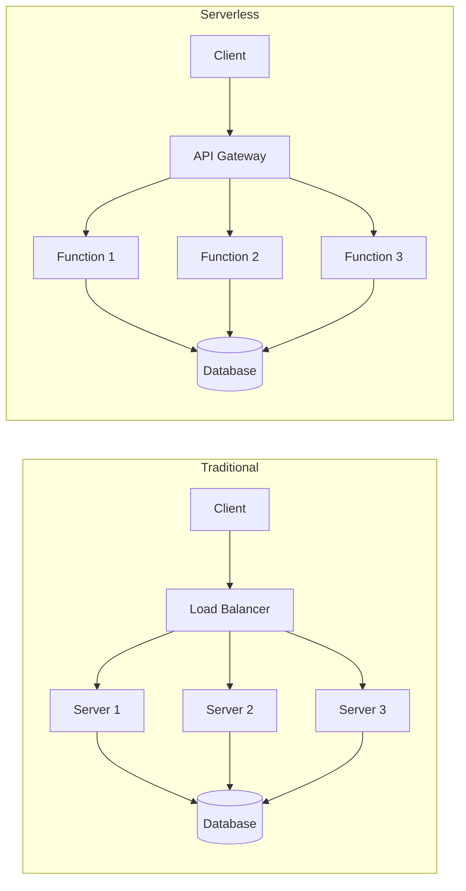
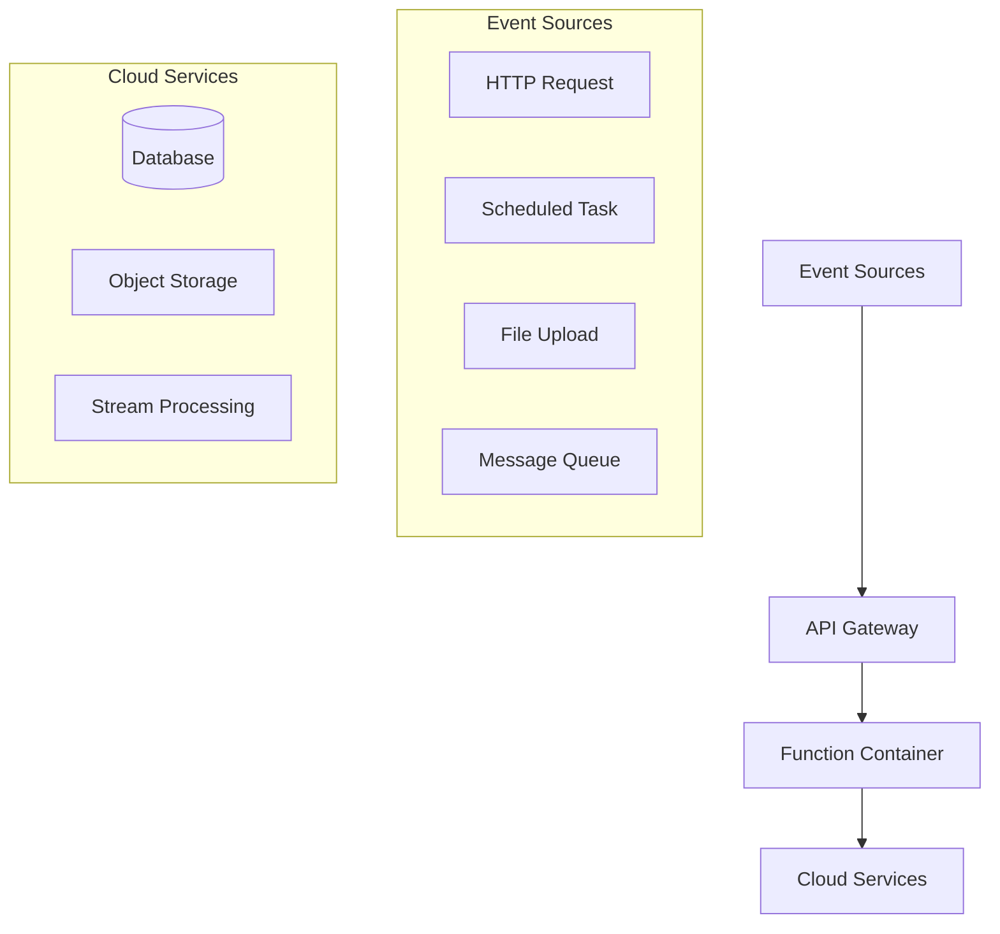
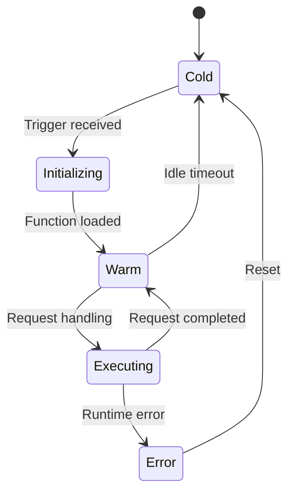
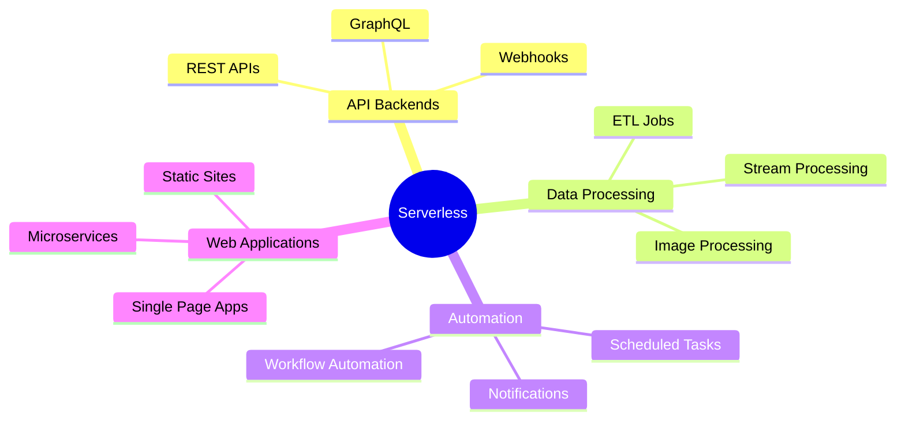
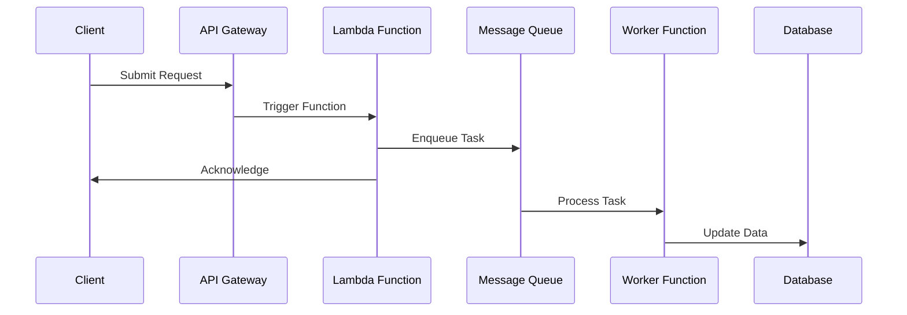
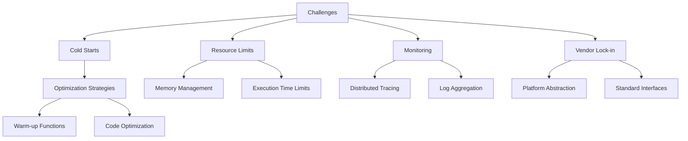

# Understanding Serverless Computing

## Introduction
Serverless computing is a cloud computing execution model where cloud providers automatically manage the infrastructure, allowing developers to focus solely on writing code. This document explains key concepts, benefits, and typical use cases of serverless architecture.

## Traditional vs. Serverless Architecture

## Serverless Event-Driven Architecture

## Serverless Function Lifecycle

## Key Benefits

1. **Cost Efficiency**
   - Pay only for actual compute time
   - No idle server costs
   - Automatic scaling

2. **Developer Productivity**
   - Focus on business logic
   - No infrastructure management
   - Rapid deployment

3. **Scalability**
   - Automatic scaling
   - Handle varying workloads
   - No capacity planning

## Common Use Cases

## Architecture Patterns

### Event-Driven Processing

## Best Practices

1. **Function Design**
   - Keep functions focused and small
   - Optimize for cold starts
   - Handle errors gracefully

2. **State Management**
   - Use external storage for state
   - Implement idempotency
   - Cache frequently accessed data

3. **Security**
   - Follow least privilege principle
   - Encrypt sensitive data
   - Use security groups and IAM roles

## Challenges and Considerations

## Conclusion

Serverless computing represents a significant shift in how we build and deploy applications. While it comes with its own set of challenges, the benefits of reduced operational complexity, automatic scaling, and cost efficiency make it an attractive choice for many modern applications.
