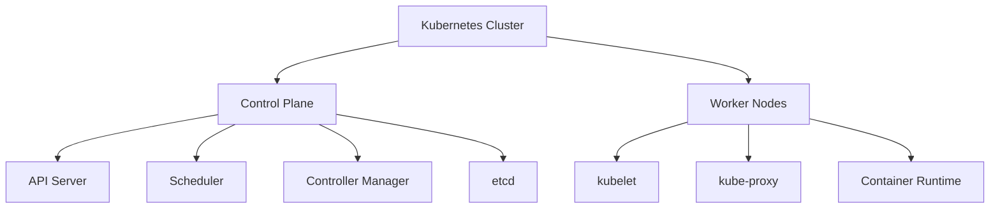
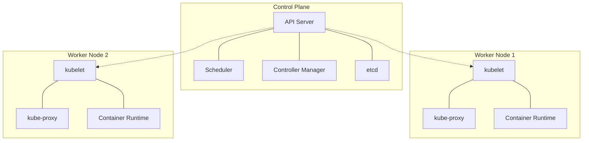
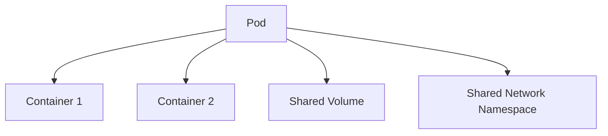
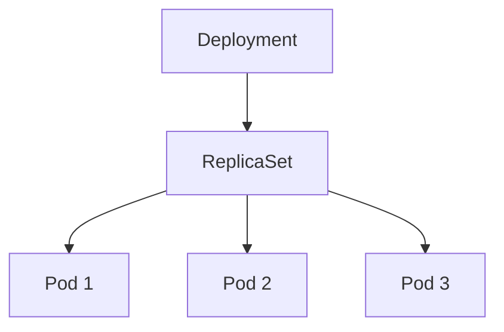
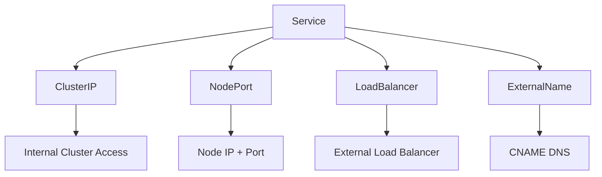
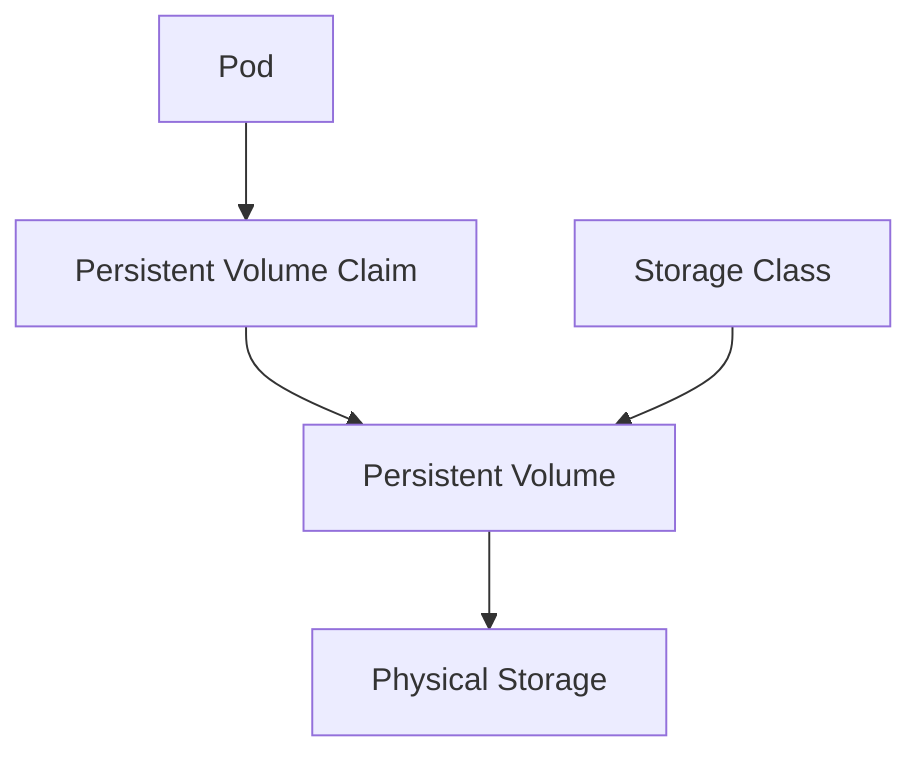
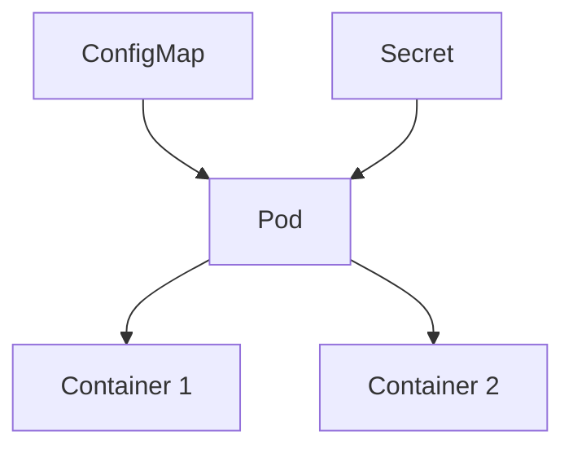
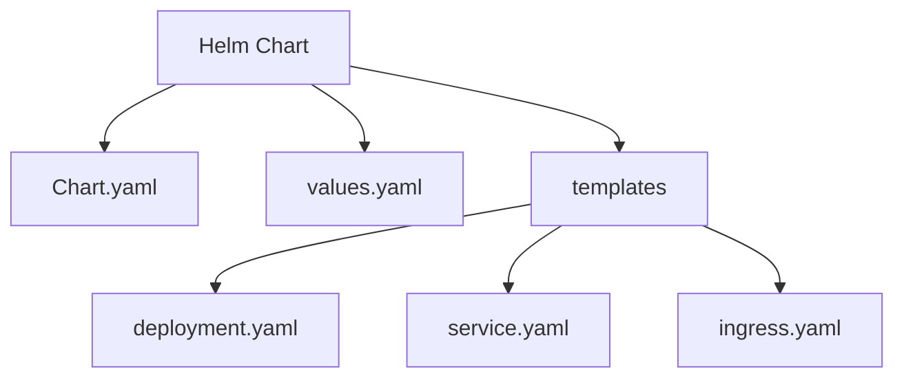

# Comprehensive Kubernetes Study Material

## Table of Contents
1. [Introduction to Kubernetes](#introduction-to-kubernetes)
2. [Setting Up the Local Environment](#setting-up-the-local-environment)
3. [Kubernetes Architecture](#kubernetes-architecture)
4. [Kubernetes Objects](#kubernetes-objects)
5. [Pods](#pods)
6. [ReplicaSets and Deployments](#replicasets-and-deployments)
7. [Services and Networking](#services-and-networking)
8. [Storage and Persistence](#storage-and-persistence)
9. [ConfigMaps and Secrets](#configmaps-and-secrets)
10. [Helm Charts](#helm-charts)
11. [Advanced Topics](#advanced-topics)
12. [Best Practices and Tips](#best-practices-and-tips)

## 1. Introduction to Kubernetes

Kubernetes is an open-source container orchestration platform that automates the deployment, scaling, and management of containerized applications.

### Key Concepts:
- Container orchestration
- Declarative configuration
- Self-healing
- Scalability

### Visual Diagram: Kubernetes Overview


## 2. Setting Up the Local Environment

To practice Kubernetes locally, we'll use Minikube, which creates a single-node Kubernetes cluster on your Windows PC.

### Prerequisites:
1. Docker Desktop (already installed)
2. Minikube
3. kubectl

### Installation Steps:

1. Install Minikube:
   ```powershell
   choco install minikube
   ```

2. Install kubectl:
   ```powershell
   choco install kubernetes-cli
   ```

3. Start Minikube:
   ```powershell
   minikube start --driver=docker
   ```

### Practical Exercise: Verify Installation

1. Check Minikube status:
   ```
   minikube status
   ```

2. Check kubectl version:
   ```
   kubectl version --client
   ```

3. View cluster information:
   ```
   kubectl cluster-info
   ```

## 3. Kubernetes Architecture

Kubernetes follows a master-worker architecture, with the control plane managing the cluster and worker nodes running the applications.

### Components:
1. Control Plane (Master)
   - API Server
   - Scheduler
   - Controller Manager
   - etcd
2. Worker Nodes
   - kubelet
   - kube-proxy
   - Container Runtime

### Visual Diagram: Kubernetes Architecture


## 4. Kubernetes Objects

Kubernetes objects are persistent entities that represent the state of your cluster. They describe what containerized applications are running, the resources they are using, and the policies around how they behave.

### Key Objects:
- Pods
- ReplicaSets
- Deployments
- Services
- ConfigMaps
- Secrets
- Volumes
- Namespaces

### Practical Exercise: Exploring Kubernetes Objects

1. List all pods in the default namespace:
   ```
   kubectl get pods
   ```

2. List all services:
   ```
   kubectl get services
   ```

3. List all deployments:
   ```
   kubectl get deployments
   ```

## 5. Pods

Pods are the smallest deployable units in Kubernetes, consisting of one or more containers that share storage and network resources.

### Key Concepts:
- Single-container pods
- Multi-container pods
- Pod lifecycle
- Pod templates

### Visual Diagram: Pod Structure


### Practical Exercise: Creating and Managing Pods

1. Create a simple pod running an Nginx container:
   ```yaml
   apiVersion: v1
   kind: Pod
   metadata:
     name: nginx-pod
   spec:
     containers:
     - name: nginx
       image: nginx:latest
       ports:
       - containerPort: 80
   ```
   Save this as `nginx-pod.yaml` and apply:
   ```
   kubectl apply -f nginx-pod.yaml
   ```

2. View pod details:
   ```
   kubectl describe pod nginx-pod
   ```

3. Access the Nginx welcome page:
   ```
   kubectl port-forward nginx-pod 8080:80
   ```
   Open a browser and visit `http://localhost:8080`

4. Delete the pod:
   ```
   kubectl delete pod nginx-pod
   ```

## 6. ReplicaSets and Deployments

ReplicaSets ensure that a specified number of pod replicas are running at any given time. Deployments provide declarative updates for Pods and ReplicaSets.

### Key Concepts:
- Desired state
- Rolling updates
- Rollbacks
- Scaling

### Visual Diagram: Deployment, ReplicaSet, and Pods


### Practical Exercise: Creating a Deployment

1. Create a deployment for a simple web application:
   ```yaml
   apiVersion: apps/v1
   kind: Deployment
   metadata:
     name: web-app
   spec:
     replicas: 3
     selector:
       matchLabels:
         app: web-app
     template:
       metadata:
         labels:
           app: web-app
       spec:
         containers:
         - name: web-app
           image: nginx:latest
           ports:
           - containerPort: 80
   ```
   Save this as `web-app-deployment.yaml` and apply:
   ```
   kubectl apply -f web-app-deployment.yaml
   ```

2. Check the deployment status:
   ```
   kubectl get deployments
   ```

3. Scale the deployment:
   ```
   kubectl scale deployment web-app --replicas=5
   ```

4. Update the deployment (change image to nginx:alpine):
   ```
   kubectl set image deployment/web-app web-app=nginx:alpine
   ```

5. Rollback the deployment:
   ```
   kubectl rollout undo deployment/web-app
   ```

## 7. Services and Networking

Services define a logical set of Pods and a policy by which to access them. They enable network access to a set of Pods.

### Types of Services:
- ClusterIP
- NodePort
- LoadBalancer
- ExternalName

### Visual Diagram: Service Types


### Practical Exercise: Creating and Accessing Services

1. Create a NodePort service for the web-app deployment:
   ```yaml
   apiVersion: v1
   kind: Service
   metadata:
     name: web-app-service
   spec:
     type: NodePort
     selector:
       app: web-app
     ports:
       - port: 80
         targetPort: 80
   ```
   Save this as `web-app-service.yaml` and apply:
   ```
   kubectl apply -f web-app-service.yaml
   ```

2. Get the NodePort:
   ```
   kubectl get service web-app-service
   ```

3. Access the service:
   ```
   minikube service web-app-service
   ```

## 8. Storage and Persistence

Kubernetes provides various ways to manage storage and persistence for applications.

### Key Concepts:
- Volumes
- Persistent Volumes (PV)
- Persistent Volume Claims (PVC)
- StorageClasses

### Visual Diagram: Persistent Storage in Kubernetes


### Practical Exercise: Using Persistent Volumes

1. Create a Persistent Volume:
   ```yaml
   apiVersion: v1
   kind: PersistentVolume
   metadata:
     name: local-pv
   spec:
     capacity:
       storage: 1Gi
     accessModes:
     - ReadWriteOnce
     persistentVolumeReclaimPolicy: Retain
     storageClassName: manual
     local:
       path: /mnt/data
     nodeAffinity:
       required:
         nodeSelectorTerms:
         - matchExpressions:
           - key: kubernetes.io/hostname
             operator: In
             values:
             - minikube
   ```
   Save this as `local-pv.yaml` and apply:
   ```
   kubectl apply -f local-pv.yaml
   ```

2. Create a Persistent Volume Claim:
   ```yaml
   apiVersion: v1
   kind: PersistentVolumeClaim
   metadata:
     name: local-pvc
   spec:
     accessModes:
     - ReadWriteOnce
     resources:
       requests:
         storage: 500Mi
     storageClassName: manual
   ```
   Save this as `local-pvc.yaml` and apply:
   ```
   kubectl apply -f local-pvc.yaml
   ```

3. Use the PVC in a Pod:
   ```yaml
   apiVersion: v1
   kind: Pod
   metadata:
     name: pv-pod
   spec:
     containers:
     - name: pv-container
       image: nginx
       volumeMounts:
       - mountPath: "/usr/share/nginx/html"
         name: pv-storage
     volumes:
     - name: pv-storage
       persistentVolumeClaim:
         claimName: local-pvc
   ```
   Save this as `pv-pod.yaml` and apply:
   ```
   kubectl apply -f pv-pod.yaml
   ```

## 9. ConfigMaps and Secrets

ConfigMaps and Secrets are used to decouple configuration artifacts from image content to keep containerized applications portable.

### Key Concepts:
- Environment variables
- Configuration files
- Sensitive information management

### Visual Diagram: ConfigMaps and Secrets Usage


### Practical Exercise: Using ConfigMaps and Secrets

1. Create a ConfigMap:
   ```
   kubectl create configmap app-config --from-literal=APP_COLOR=blue --from-literal=APP_ENV=prod
   ```

2. Create a Secret:
   ```
   kubectl create secret generic app-secret --from-literal=DB_Password=mysecretpassword
   ```

3. Use ConfigMap and Secret in a Pod:
   ```yaml
   apiVersion: v1
   kind: Pod
   metadata:
     name: config-pod
   spec:
     containers:
     - name: config-container
       image: nginx
       env:
       - name: APP_COLOR
         valueFrom:
           configMapKeyRef:
             name: app-config
             key: APP_COLOR
       - name: DB_PASSWORD
         valueFrom:
           secretKeyRef:
             name: app-secret
             key: DB_Password
   ```
   Save this as `config-pod.yaml` and apply:
   ```
   kubectl apply -f config-pod.yaml
   ```

4. Verify the configuration:
   ```
   kubectl exec config-pod -- env | grep APP_COLOR
   kubectl exec config-pod -- env | grep DB_PASSWORD
   ```

## 10. Helm Charts

Helm is a package manager for Kubernetes that allows you to define, install, and upgrade even the most complex Kubernetes applications.

### Key Concepts:
- Charts
- Releases
- Repositories

### Visual Diagram: Helm Chart Structure


### Practical Exercise: Creating and Using a Helm Chart

1. Install Helm:
   ```
   choco install kubernetes-helm
   ```

2. Create a new Helm chart:
   ```
   helm create mychart
   ```

3. Modify the `values.yaml` file in the `mychart` directory to customize the deployment.

4. Install the chart:
   ```
   helm install myrelease ./mychart
   ```

5. List the releases:
   ```
   helm list
   ```

6. Upgrade the release:
   ```
   helm upgrade myrelease ./mychart --set replicaCount=3
   ```

7. Uninstall the release:
   ```
   helm uninstall myrelease
   ```

## 11. Advanced Topics

After mastering the basics, you can explore these advanced Kubernetes topics:

- Horizontal Pod Autoscaling
- Custom Resource Definitions (CRDs)
- Operators
- Istio and Service Mesh
- Kubernetes Federation
- Monitoring and Logging (Prometheus, Grafana, ELK stack)

## 12. Best Practices and Tips

- Always use version control for your Kubernetes manifests
- Implement proper resource requests and limits
- Use namespaces to organize your resources
- Implement proper security measures (RBAC, Network Policies)
- Regularly update and patch your Kubernetes cluster
- Use linting tools to check your YAML files
- Implement proper backup and disaster recovery strategies

This comprehensive study material covers all the essential Kubernetes concepts, starting from the basics and progressing to more advanced topics. The included practical exercises will help reinforce the learned concepts, and the visual diagrams will aid in understanding the relationships between different Kubernetes components.

As an instructor, you can use this material to structure your course, and students can refer to it for self-study and hands-on practice. Remember to encourage students to experiment with different configurations and scenarios to deepen their understanding of Kubernetes.
