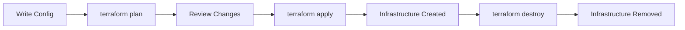
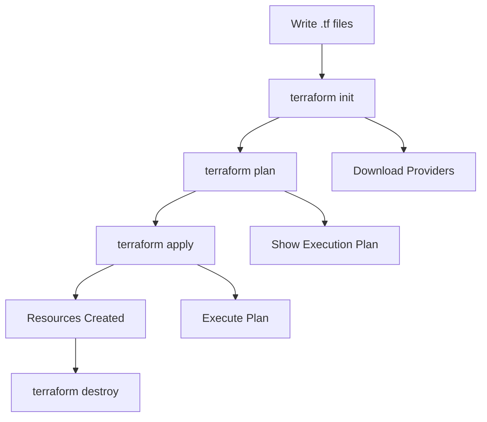
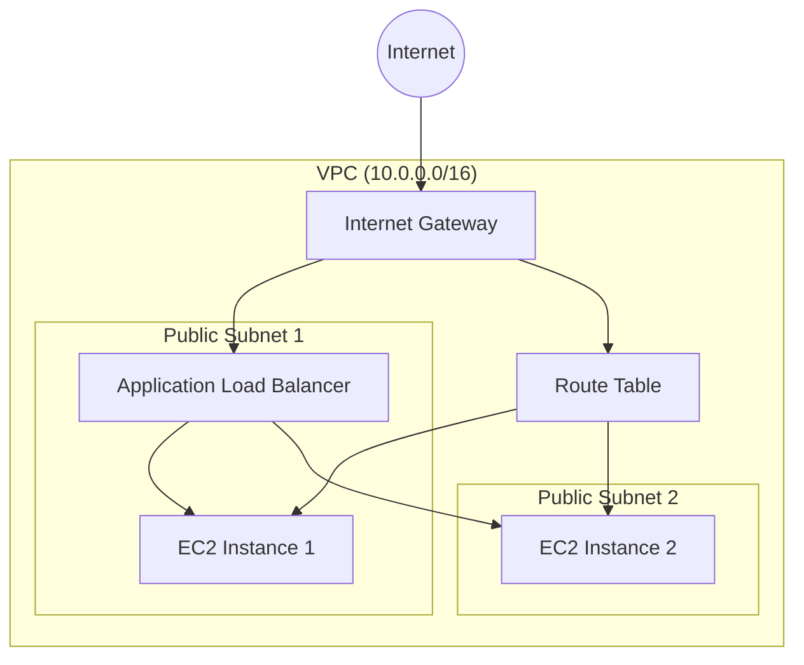

# 🚀 Complete Terraform Study Guide for Beginners

## 📋 Table of Contents
1. [What is Terraform?](#what-is-terraform)
2. [Core Concepts](#core-concepts)
3. [Installation & Setup](#installation--setup)
4. [Basic Syntax](#basic-syntax)
5. [Docker Examples](#docker-examples)
6. [AWS Examples](#aws-examples)
7. [Best Practices](#best-practices)
8. [Common Commands](#common-commands)
9. [Troubleshooting](#troubleshooting)

---

## 🤔 What is Terraform?

**Terraform** is an open-source Infrastructure as Code (IaC) tool created by HashiCorp. It allows you to define and provision infrastructure using a declarative configuration language.

### Key Benefits:
- 🔄 **Reproducible**: Same configuration = same infrastructure
- 🌐 **Multi-cloud**: Works with AWS, Azure, GCP, Docker, and more
- 📝 **Version Control**: Track infrastructure changes like code
- 🔧 **Automation**: Reduce manual configuration errors

### How Terraform Works:



---

## 🏗️ Core Concepts

### 1. **Providers**
Plugins that interact with APIs of cloud providers, SaaS providers, and other services.

### 2. **Resources**
The most important element - represents infrastructure objects (VM, network, etc.)

### 3. **Data Sources**
Fetch information from existing infrastructure

### 4. **Variables**
Input parameters for your configuration

### 5. **Outputs**
Return values from your configuration

### 6. **Modules**
Reusable configuration components

### Terraform Workflow:



---

## 🔧 Installation & Setup

### Install Terraform

**macOS:**
```bash
brew install terraform
```

**Windows:**
```bash
choco install terraform
```

**Linux:**
```bash
wget https://releases.hashicorp.com/terraform/1.6.0/terraform_1.6.0_linux_amd64.zip
unzip terraform_1.6.0_linux_amd64.zip
sudo mv terraform /usr/local/bin/
```

### Verify Installation
```bash
terraform --version
```

---

## 📝 Basic Syntax

### Configuration File Structure (.tf)

```hcl
# Provider configuration
provider "aws" {
  region = "us-west-2"
}

# Variable definition
variable "instance_count" {
  description = "Number of instances"
  type        = number
  default     = 1
}

# Resource definition
resource "aws_instance" "web" {
  count         = var.instance_count
  ami           = "ami-12345678"
  instance_type = "t2.micro"
  
  tags = {
    Name = "WebServer-${count.index}"
  }
}

# Output definition
output "instance_ip" {
  value = aws_instance.web[*].public_ip
}
```

### Data Types
- **string**: `"hello"`
- **number**: `42`
- **bool**: `true`
- **list**: `["item1", "item2"]`
- **map**: `{key1 = "value1", key2 = "value2"}`

---

## 🐳 Docker Examples

Let's start with Docker since you have Docker Desktop installed!

### Example 1: Simple Nginx Container

Create a file called `main.tf`:

```hcl
# Configure the Docker provider
terraform {
  required_providers {
    docker = {
      source  = "kreuzwerker/docker"
      version = "~> 3.0"
    }
  }
}

provider "docker" {}

# Pull the nginx image
resource "docker_image" "nginx" {
  name = "nginx:latest"
}

# Create a container
resource "docker_container" "nginx_server" {
  image = docker_image.nginx.image_id
  name  = "my-nginx-server"
  
  ports {
    internal = 80
    external = 8080
  }
}
```

**Commands to run:**
```bash
# Initialize Terraform
terraform init

# See what will be created
terraform plan

# Apply the configuration
terraform apply

# Test your container
curl http://localhost:8080

# Destroy when done
terraform destroy
```

### Example 2: Multi-Container Web Stack

Create `docker-stack.tf`:

```hcl
terraform {
  required_providers {
    docker = {
      source  = "kreuzwerker/docker"
      version = "~> 3.0"
    }
  }
}

provider "docker" {}

# Create a custom network
resource "docker_network" "web_network" {
  name = "web-network"
}

# Database container (PostgreSQL)
resource "docker_image" "postgres" {
  name = "postgres:13"
}

resource "docker_container" "database" {
  image = docker_image.postgres.image_id
  name  = "postgres-db"
  
  env = [
    "POSTGRES_DB=myapp",
    "POSTGRES_USER=admin",
    "POSTGRES_PASSWORD=password123"
  ]
  
  ports {
    internal = 5432
    external = 5432
  }
  
  networks_advanced {
    name = docker_network.web_network.name
  }
}

# Redis container
resource "docker_image" "redis" {
  name = "redis:alpine"
}

resource "docker_container" "cache" {
  image = docker_image.redis.image_id
  name  = "redis-cache"
  
  ports {
    internal = 6379
    external = 6379
  }
  
  networks_advanced {
    name = docker_network.web_network.name
  }
}

# Web application container
resource "docker_image" "webapp" {
  name = "nginx:latest"
}

resource "docker_container" "web" {
  image = docker_image.webapp.image_id
  name  = "web-app"
  
  ports {
    internal = 80
    external = 8080
  }
  
  networks_advanced {
    name = docker_network.web_network.name
  }
  
  depends_on = [
    docker_container.database,
    docker_container.cache
  ]
}
```

### Example 3: Parameterized Docker Setup

Create `variables.tf`:

```hcl
variable "app_name" {
  description = "Name of the application"
  type        = string
  default     = "my-web-app"
}

variable "web_port" {
  description = "External port for web server"
  type        = number
  default     = 8080
}

variable "db_password" {
  description = "Database password"
  type        = string
  sensitive   = true
  default     = "secure-password-123"
}
```

Create `docker-app.tf`:

```hcl
terraform {
  required_providers {
    docker = {
      source  = "kreuzwerker/docker"
      version = "~> 3.0"
    }
  }
}

provider "docker" {}

resource "docker_network" "app_network" {
  name = "${var.app_name}-network"
}

resource "docker_image" "nginx" {
  name = "nginx:latest"
}

resource "docker_container" "web" {
  image = docker_image.nginx.image_id
  name  = "${var.app_name}-web"
  
  ports {
    internal = 80
    external = var.web_port
  }
  
  networks_advanced {
    name = docker_network.app_network.name
  }
}
```

Create `outputs.tf`:

```hcl
output "web_url" {
  description = "URL to access the web application"
  value       = "http://localhost:${var.web_port}"
}

output "container_name" {
  description = "Name of the web container"
  value       = docker_container.web.name
}
```

**Usage:**
```bash
# Use custom values
terraform apply -var="app_name=my-blog" -var="web_port=3000"

# Or create terraform.tfvars file
echo 'app_name = "my-blog"' > terraform.tfvars
echo 'web_port = 3000' >> terraform.tfvars
terraform apply
```

---

## ☁️ AWS Examples

### Prerequisites
1. AWS CLI installed and configured
2. AWS credentials set up (`aws configure`)

### Example 1: Simple EC2 Instance

Create `aws-ec2.tf`:

```hcl
terraform {
  required_providers {
    aws = {
      source  = "hashicorp/aws"
      version = "~> 5.0"
    }
  }
}

provider "aws" {
  region = var.aws_region
}

variable "aws_region" {
  description = "AWS region"
  type        = string
  default     = "us-west-2"
}

variable "instance_type" {
  description = "EC2 instance type"
  type        = string
  default     = "t2.micro"
}

# Data source to get latest Amazon Linux AMI
data "aws_ami" "amazon_linux" {
  most_recent = true
  owners      = ["amazon"]
  
  filter {
    name   = "name"
    values = ["amzn2-ami-hvm-*-x86_64-gp2"]
  }
}

# Security group
resource "aws_security_group" "web_sg" {
  name_prefix = "web-sg-"
  
  ingress {
    from_port   = 22
    to_port     = 22
    protocol    = "tcp"
    cidr_blocks = ["0.0.0.0/0"]
  }
  
  ingress {
    from_port   = 80
    to_port     = 80
    protocol    = "tcp"
    cidr_blocks = ["0.0.0.0/0"]
  }
  
  egress {
    from_port   = 0
    to_port     = 0
    protocol    = "-1"
    cidr_blocks = ["0.0.0.0/0"]
  }
}

# EC2 instance
resource "aws_instance" "web" {
  ami           = data.aws_ami.amazon_linux.id
  instance_type = var.instance_type
  
  vpc_security_group_ids = [aws_security_group.web_sg.id]
  
  user_data = <<-EOF
    #!/bin/bash
    yum update -y
    yum install -y httpd
    systemctl start httpd
    systemctl enable httpd
    echo "<h1>Hello from Terraform!</h1>" > /var/www/html/index.html
  EOF
  
  tags = {
    Name = "TerraformWebServer"
  }
}

output "instance_public_ip" {
  description = "Public IP address of the EC2 instance"
  value       = aws_instance.web.public_ip
}

output "instance_public_dns" {
  description = "Public DNS name of the EC2 instance"
  value       = aws_instance.web.public_dns
}
```

### Example 2: VPC with Load Balancer

Create `aws-vpc.tf`:

```hcl
terraform {
  required_providers {
    aws = {
      source  = "hashicorp/aws"
      version = "~> 5.0"
    }
  }
}

provider "aws" {
  region = "us-west-2"
}

# VPC
resource "aws_vpc" "main" {
  cidr_block           = "10.0.0.0/16"
  enable_dns_hostnames = true
  enable_dns_support   = true
  
  tags = {
    Name = "main-vpc"
  }
}

# Internet Gateway
resource "aws_internet_gateway" "main" {
  vpc_id = aws_vpc.main.id
  
  tags = {
    Name = "main-igw"
  }
}

# Public Subnets
resource "aws_subnet" "public" {
  count             = 2
  vpc_id            = aws_vpc.main.id
  cidr_block        = "10.0.${count.index + 1}.0/24"
  availability_zone = data.aws_availability_zones.available.names[count.index]
  
  map_public_ip_on_launch = true
  
  tags = {
    Name = "public-subnet-${count.index + 1}"
  }
}

# Data source for availability zones
data "aws_availability_zones" "available" {
  state = "available"
}

# Route table
resource "aws_route_table" "public" {
  vpc_id = aws_vpc.main.id
  
  route {
    cidr_block = "0.0.0.0/0"
    gateway_id = aws_internet_gateway.main.id
  }
  
  tags = {
    Name = "public-rt"
  }
}

# Route table associations
resource "aws_route_table_association" "public" {
  count          = 2
  subnet_id      = aws_subnet.public[count.index].id
  route_table_id = aws_route_table.public.id
}

# Security group for load balancer
resource "aws_security_group" "lb_sg" {
  name_prefix = "lb-sg-"
  vpc_id      = aws_vpc.main.id
  
  ingress {
    from_port   = 80
    to_port     = 80
    protocol    = "tcp"
    cidr_blocks = ["0.0.0.0/0"]
  }
  
  egress {
    from_port   = 0
    to_port     = 0
    protocol    = "-1"
    cidr_blocks = ["0.0.0.0/0"]
  }
}

# Security group for instances
resource "aws_security_group" "instance_sg" {
  name_prefix = "instance-sg-"
  vpc_id      = aws_vpc.main.id
  
  ingress {
    from_port       = 80
    to_port         = 80
    protocol        = "tcp"
    security_groups = [aws_security_group.lb_sg.id]
  }
  
  egress {
    from_port   = 0
    to_port     = 0
    protocol    = "-1"
    cidr_blocks = ["0.0.0.0/0"]
  }
}

# Launch template
resource "aws_launch_template" "web" {
  name_prefix   = "web-template-"
  image_id      = data.aws_ami.amazon_linux.id
  instance_type = "t2.micro"
  
  vpc_security_group_ids = [aws_security_group.instance_sg.id]
  
  user_data = base64encode(<<-EOF
    #!/bin/bash
    yum update -y
    yum install -y httpd
    systemctl start httpd
    systemctl enable httpd
    echo "<h1>Hello from $(hostname -f)</h1>" > /var/www/html/index.html
  EOF
  )
  
  tag_specifications {
    resource_type = "instance"
    tags = {
      Name = "web-server"
    }
  }
}

# Auto Scaling Group
resource "aws_autoscaling_group" "web" {
  name                = "web-asg"
  vpc_zone_identifier = aws_subnet.public[*].id
  target_group_arns   = [aws_lb_target_group.web.arn]
  health_check_type   = "ELB"
  
  min_size         = 2
  max_size         = 4
  desired_capacity = 2
  
  launch_template {
    id      = aws_launch_template.web.id
    version = "$Latest"
  }
  
  tag {
    key                 = "Name"
    value               = "web-asg"
    propagate_at_launch = false
  }
}

# Application Load Balancer
resource "aws_lb" "web" {
  name               = "web-lb"
  internal           = false
  load_balancer_type = "application"
  security_groups    = [aws_security_group.lb_sg.id]
  subnets            = aws_subnet.public[*].id
  
  enable_deletion_protection = false
  
  tags = {
    Name = "web-lb"
  }
}

# Target Group
resource "aws_lb_target_group" "web" {
  name     = "web-tg"
  port     = 80
  protocol = "HTTP"
  vpc_id   = aws_vpc.main.id
  
  health_check {
    enabled             = true
    healthy_threshold   = 2
    unhealthy_threshold = 2
    timeout             = 5
    interval            = 30
    path                = "/"
    matcher             = "200"
  }
}

# Listener
resource "aws_lb_listener" "web" {
  load_balancer_arn = aws_lb.web.arn
  port              = "80"
  protocol          = "HTTP"
  
  default_action {
    type             = "forward"
    target_group_arn = aws_lb_target_group.web.arn
  }
}

# Data source for AMI
data "aws_ami" "amazon_linux" {
  most_recent = true
  owners      = ["amazon"]
  
  filter {
    name   = "name"
    values = ["amzn2-ami-hvm-*-x86_64-gp2"]
  }
}

# Outputs
output "load_balancer_dns" {
  description = "DNS name of the load balancer"
  value       = aws_lb.web.dns_name
}

output "load_balancer_url" {
  description = "URL of the load balancer"
  value       = "http://${aws_lb.web.dns_name}"
}
```

### AWS Infrastructure Diagram



---

## 🎯 Best Practices

### 1. **File Organization**
```
project/
├── main.tf          # Main configuration
├── variables.tf     # Input variables
├── outputs.tf       # Output values
├── terraform.tfvars # Variable values
└── modules/         # Reusable modules
    └── vpc/
        ├── main.tf
        ├── variables.tf
        └── outputs.tf
```

### 2. **Use Variables**
```hcl
variable "environment" {
  description = "Environment name"
  type        = string
  validation {
    condition     = contains(["dev", "staging", "prod"], var.environment)
    error_message = "Environment must be dev, staging, or prod."
  }
}
```

### 3. **Remote State**
```hcl
terraform {
  backend "s3" {
    bucket = "my-terraform-state"
    key    = "prod/terraform.tfstate"
    region = "us-west-2"
  }
}
```

### 4. **Use Modules**
```hcl
module "vpc" {
  source = "./modules/vpc"
  
  cidr_block = "10.0.0.0/16"
  environment = var.environment
}
```

### 5. **Tagging Strategy**
```hcl
locals {
  common_tags = {
    Environment = var.environment
    Project     = var.project_name
    Owner       = var.team_name
    CreatedBy   = "Terraform"
  }
}

resource "aws_instance" "web" {
  # ... other configuration
  
  tags = merge(local.common_tags, {
    Name = "web-server"
    Role = "web"
  })
}
```

---

## 🛠️ Common Commands

### Essential Commands
```bash
# Initialize working directory
terraform init

# Validate configuration
terraform validate

# Format code
terraform fmt

# Plan changes
terraform plan

# Apply changes
terraform apply

# Destroy resources
terraform destroy

# Show current state
terraform show

# List resources in state
terraform state list

# Import existing resource
terraform import aws_instance.web i-1234567890abcdef0

# Output values
terraform output

# Refresh state
terraform refresh
```

### Advanced Commands
```bash
# Plan with specific var file
terraform plan -var-file="prod.tfvars"

# Apply with auto-approve
terraform apply -auto-approve

# Plan targeting specific resource
terraform plan -target=aws_instance.web

# Show state of specific resource
terraform state show aws_instance.web

# Move resource in state
terraform state mv aws_instance.web aws_instance.web_server

# Remove resource from state
terraform state rm aws_instance.web
```

---

## 🔧 Troubleshooting

### Common Issues & Solutions

#### 1. **Provider Version Conflicts**
```hcl
# Use version constraints
terraform {
  required_providers {
    aws = {
      source  = "hashicorp/aws"
      version = "~> 5.0"
    }
  }
}
```

#### 2. **State File Issues**
```bash
# Backup state before making changes
cp terraform.tfstate terraform.tfstate.backup

# Unlock state if stuck
terraform force-unlock LOCK_ID
```

#### 3. **Resource Dependencies**
```hcl
# Explicit dependencies
resource "aws_instance" "web" {
  # ... configuration
  depends_on = [aws_security_group.web_sg]
}
```

#### 4. **Debugging**
```bash
# Enable debug logging
export TF_LOG=DEBUG
export TF_LOG_PATH=./terraform.log

# Run terraform commands
terraform plan
```

### Error Messages & Solutions

| Error | Solution |
|-------|----------|
| `Provider configuration not present` | Run `terraform init` |
| `Resource already exists` | Use `terraform import` |
| `State lock` | Use `terraform force-unlock` |
| `Invalid configuration` | Run `terraform validate` |

---

## 📚 Additional Resources

### Official Documentation
- [Terraform Documentation](https://www.terraform.io/docs)
- [AWS Provider Documentation](https://registry.terraform.io/providers/hashicorp/aws/latest/docs)
- [Docker Provider Documentation](https://registry.terraform.io/providers/kreuzwerker/docker/latest/docs)

### Learning Path
1. ✅ Complete Docker examples
2. ✅ Try AWS simple examples
3. 📖 Learn about state management
4. 📖 Explore modules
5. 📖 Practice with real projects

### Quick Reference Card

| Task | Command |
|------|---------|
| Initialize | `terraform init` |
| Plan | `terraform plan` |
| Apply | `terraform apply` |
| Destroy | `terraform destroy` |
| Format | `terraform fmt` |
| Validate | `terraform validate` |

---

## 🎉 Practice Exercises

### Exercise 1: Docker Multi-Service App
Create a Docker stack with:
- Web server (nginx)
- Database (postgres)
- Cache (redis)
- Custom network

### Exercise 2: AWS Three-Tier Architecture
Build:
- VPC with public/private subnets
- Load balancer
- Web servers in private subnets
- RDS database

### Exercise 3: Infrastructure Modules
Create reusable modules for:
- VPC creation
- Security groups
- EC2 instances

---

**🚀 Happy Terraforming!** Remember: Infrastructure as Code makes your deployments reproducible, scalable, and maintainable. Start small, practice regularly, and gradually build more complex infrastructures.
