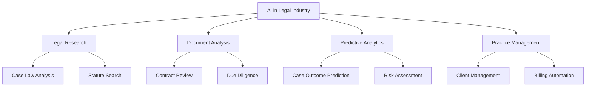
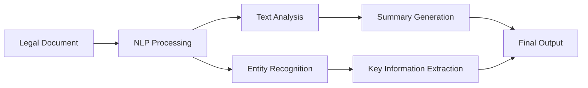
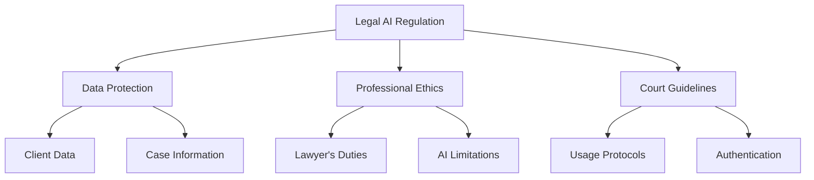

# AI in the Legal Industry
## A Comprehensive Guide for Indian Law Students

### Table of Contents
1. Introduction
2. Core AI Technologies in Law
3. Applications in Indian Legal Context
4. Regulatory Framework
5. Ethical Considerations
6. Future of Legal Practice
7. Case Studies
8. Practice Questions

### 1. Introduction 🔖

The integration of Artificial Intelligence in the legal sector marks a paradigm shift in how legal services are delivered and justice is administered.

### 2. Core AI Technologies in Law ⚙️

#### 2.1 Natural Language Processing (NLP)
- Case law analysis
- Legal document summarization
- Multilingual processing (crucial for Indian courts)

#### 2.2 Machine Learning
- Precedent analysis
- Judgment prediction
- Pattern recognition in cases

### 3. Applications in Indian Legal Context 🏛️

#### 3.1 E-Courts Initiative
- SUPACE (Supreme Court's AI portal)
- Virtual Courts implementation
- Case categorization and allocation

#### 3.2 Legal Research Tools
- Indian Kanoon integration
- SCC Online AI features
- Manupatra's search capabilities

### 4. Regulatory Framework 📜

#### 4.1 Current Guidelines
- NITI Aayog's AI Framework
- Bar Council regulations on tech usage
- Supreme Court IT Committee guidelines

#### 4.2 Data Protection
- Personal Data Protection Bill implications
- Client confidentiality in AI era
- Cross-border data flows

### 5. Ethical Considerations 🤔

#### 5.1 Key Concerns
- Bias in AI systems
- Transparency
- Accountability
- Access to justice

#### 5.2 Professional Responsibility
- Duty to stay technologically competent
- Supervision of AI tools
- Disclosure to clients

### 6. Future of Legal Practice 🔮

#### 6.1 Emerging Trends
- Smart contracts
- Automated compliance
- Blockchain in legal services
- Legal process automation

#### 6.2 Skills for Future Lawyers
- AI literacy
- Data analysis
- Technology management
- Ethical AI usage

### 7. Case Studies 📚

#### 7.1 State of Punjab v. Arjun [2020]
- First use of AI analytics in evidence analysis
- Impact on judicial decision-making

#### 7.2 TCS v. Cyrus Mistry [2021]
- Role of AI in corporate law disputes
- Document analysis at scale

### 8. Practice Questions ✍️

1. Explain the role of NLP in legal document analysis.
2. Discuss ethical implications of using AI for case outcome prediction.
3. How does SUPACE enhance Supreme Court's efficiency?
4. Analyze the challenges of implementing AI in rural Indian courts.

### Key Statistics 📊

- 25% reduction in legal research time
- 30% improvement in contract review accuracy
- 40% cost reduction in due diligence
- 60% faster case law analysis

### Additional Resources 📚

1. NITI Aayog's AI Strategy Papers
2. Supreme Court E-Committee Reports
3. Bar Council Guidelines on Legal Tech
4. International Legal Technology Association (ILTA) Resources

---
*Note: This material is current as of 2024 and reflects the Indian legal technology landscape.*
