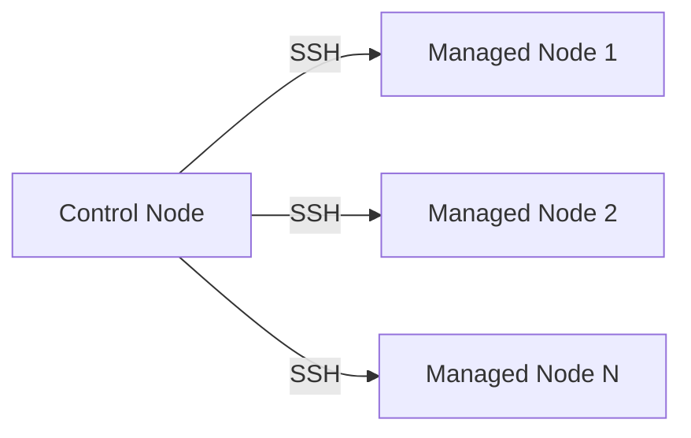
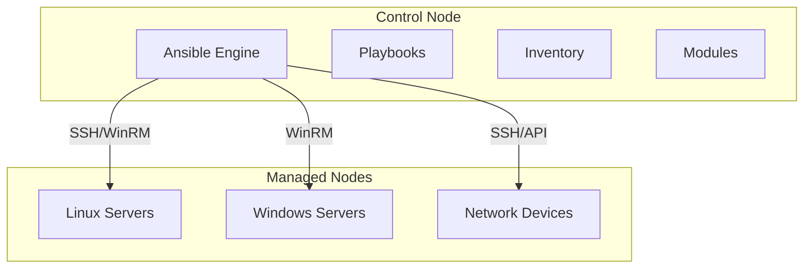

# Unit V: Introduction to Ansible

## 1. Introduction to Ansible and Configuration Management

### What is Ansible?
Ansible is an open-source automation tool for configuration management, application deployment, and task automation using simple YAML syntax.

### Key Characteristics
- **Agentless**: No software installation on managed nodes
- **Declarative**: Describe desired state, not steps
- **Idempotent**: Safe to run multiple times
- **Simple**: Human-readable YAML syntax

### Configuration Management Benefits
- Eliminates configuration drift
- Ensures consistency across environments
- Provides version control for infrastructure
- Enables automated deployments

## 2. How Ansible Works

### Architecture Overview


### Execution Flow
1. **Read Inventory**: Identifies target hosts
2. **Parse Playbook**: Interprets YAML instructions
3. **Generate Modules**: Creates Python code
4. **Execute**: Transfers and runs code on targets
5. **Report**: Returns results and cleans up

## 3. Modern Infrastructure Management

### Traditional vs Modern Approach

| Aspect | Traditional | Modern (Ansible) |
|--------|-------------|------------------|
| Configuration | Manual/Scripts | Declarative YAML |
| Scalability | Limited | Highly Scalable |
| Consistency | Configuration Drift | Consistent State |
| Documentation | Separate | Self-documenting |
| Recovery | Manual | Automated |

### Infrastructure as Code Benefits
- ✅ Version control
- ✅ Reproducible environments
- ✅ Team collaboration
- ✅ Automated testing
- ✅ Compliance enforcement

## 4. Ansible and Red Hat

### Key Points
- Red Hat acquired Ansible in 2015
- Community version remains open-source
- Enterprise version adds GUI, RBAC, support
- Ansible Tower/Controller for enterprise features

## 5. Ansible Architecture

### Core Components


### Component Definitions
- **Control Node**: Machine where Ansible is installed
- **Managed Nodes**: Target machines being managed
- **Inventory**: File defining hosts and groups
- **Modules**: Reusable code units for specific tasks
- **Playbooks**: YAML files with automation instructions

## 6. From Shell Scripts to Ansible

### Evolution Example

#### Shell Script Approach
```bash
#!/bin/bash
apt update
apt install -y nginx
systemctl start nginx
systemctl enable nginx
```
**Problems**: Not idempotent, error-prone, platform-specific

#### Ansible Approach
```yaml
---
- name: Install and start nginx
  hosts: webservers
  become: yes
  tasks:
    - name: Install nginx
      apt:
        name: nginx
        state: present
        update_cache: yes
    
    - name: Start and enable nginx
      service:
        name: nginx
        state: started
        enabled: yes
```
**Benefits**: Idempotent, cross-platform, error handling

## 7. Installing Ansible

### System Requirements
- **Control Node**: Python 3.8+, Linux/Unix, SSH client
- **Managed Nodes**: Python 2.7/3.5+, SSH server

### Installation Methods

#### Using pip (Recommended)
```bash
# Install Ansible
pip3 install ansible

# Verify installation
ansible --version
```

#### Using Package Manager (Ubuntu)
```bash
sudo apt update
sudo apt install software-properties-common
sudo add-apt-repository --yes --update ppa:ansible/ansible
sudo apt install ansible
```

#### Using Package Manager (CentOS/RHEL)
```bash
sudo yum install epel-release
sudo yum install ansible
```

## 8. Creating Basic Inventory File

### Inventory Purpose
Defines hosts and groups that Ansible manages

### Basic INI Format
```ini
# inventory.ini
[webservers]
web1.example.com
web2.example.com
192.168.1.10

[databases]
db1.example.com
db2.example.com

[all:vars]
ansible_user=ubuntu
ansible_ssh_private_key_file=~/.ssh/id_rsa
```

### Advanced Inventory with Variables
```ini
[webservers]
web1.example.com ansible_host=192.168.1.10 http_port=80
web2.example.com ansible_host=192.168.1.11 http_port=8080

[webservers:vars]
server_role=web
environment=production

[databases]
db1.example.com ansible_host=192.168.1.20 mysql_port=3306

[production:children]
webservers
databases
```

### Testing Inventory
```bash
# List all hosts
ansible all --list-hosts -i inventory.ini

# Test connectivity
ansible all -m ping -i inventory.ini

# Get system facts
ansible webservers -m setup -i inventory.ini
```

## 9. Practical: Docker-based Ansible Setup

### Project Structure
```
ansible-docker-demo/
├── docker-compose.yml
├── Dockerfile.master
└── Dockerfile.node
```

### Docker Compose Configuration
```yaml
version: '3.8'
services:
  ansible-master:
    build:
      context: .
      dockerfile: Dockerfile.master
    container_name: ansible-master
    networks:
      - ansible-network
    depends_on: [node1, node2]

  node1:
    build:
      context: .
      dockerfile: Dockerfile.node
    container_name: node1
    networks:
      - ansible-network

  node2:
    build:
      context: .
      dockerfile: Dockerfile.node
    container_name: node2
    networks:
      - ansible-network

networks:
  ansible-network:
    driver: bridge
```

### Setup Steps

1. **Create project and start containers**
```bash
mkdir ansible-docker-demo && cd ansible-docker-demo
# Create Docker files (provided in detailed documentation)
docker-compose up -d
```

2. **Access master container**
```bash
docker-compose exec ansible-master bash
```

3. **Create inventory file**
```bash
cat > inventory.ini << 'EOF'
[managed_nodes]
node1 ansible_host=node1 ansible_user=ansible ansible_ssh_pass=ansible123
node2 ansible_host=node2 ansible_user=ansible ansible_ssh_pass=ansible123

[all:vars]
ansible_python_interpreter=/usr/bin/python3
ansible_ssh_common_args='-o StrictHostKeyChecking=no'
EOF
```

4. **Create ansible.cfg**
```bash
cat > ansible.cfg << 'EOF'
[defaults]
inventory = inventory.ini
host_key_checking = False
deprecation_warnings = False
EOF
```

5. **Test connectivity**
```bash
ansible all -m ping
```

### Essential Commands
```bash
# Basic operations
ansible all -m ping                    # Test connectivity
ansible all -m setup                   # Get system facts
ansible all -m shell -a "uptime"       # Run shell command

# Package management
ansible all -m apt -a "name=vim state=present" --become

# File operations
ansible all -m file -a "path=/tmp/test state=directory"
ansible all -m copy -a "content='Hello' dest=/tmp/hello.txt"
```

### Sample Playbook
```yaml
---
- name: Hello World Playbook
  hosts: managed_nodes
  become: yes
  tasks:
    - name: Create test file
      copy:
        content: "Created by Ansible on {{ ansible_date_time.date }}"
        dest: /tmp/ansible-test.txt
    
    - name: Install package
      apt:
        name: vim-tiny
        state: present
        update_cache: yes
    
    - name: Display system info
      debug:
        msg: "Host: {{ inventory_hostname }}, OS: {{ ansible_distribution }}"
```

## 10. Key Concepts Summary

### Essential Terms
- **Control Node**: Ansible management machine
- **Managed Nodes**: Target systems
- **Inventory**: Host and group definitions
- **Modules**: Task execution units
- **Tasks**: Individual work units
- **Playbooks**: Automation scripts in YAML
- **Facts**: System information gathered automatically

### Best Practices
- Start with simple tasks
- Use version control for playbooks
- Test in development first
- Use check mode (`--check`) for dry runs
- Keep playbooks readable with good naming
- Document your automation

---

## Summary

Unit V covered Ansible fundamentals:
- ✅ Understanding Ansible concepts and benefits
- ✅ How Ansible architecture works
- ✅ Installation methods and requirements  
- ✅ Creating and managing inventory files
- ✅ Hands-on Docker environment setup
- ✅ Basic command execution and testing

**Next**: Unit VI will cover advanced features including playbooks, roles, variables, and cloud deployments.