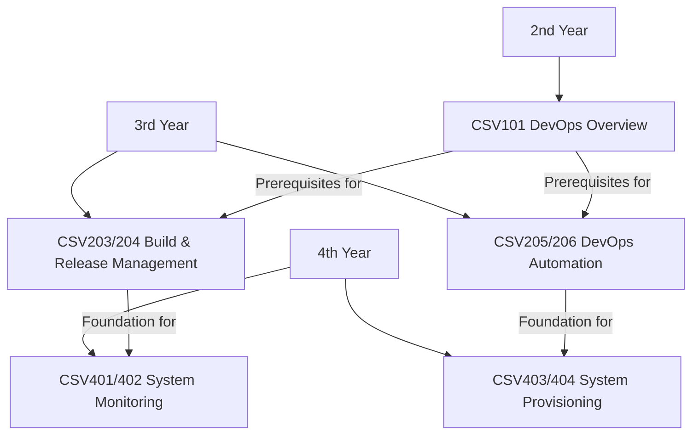
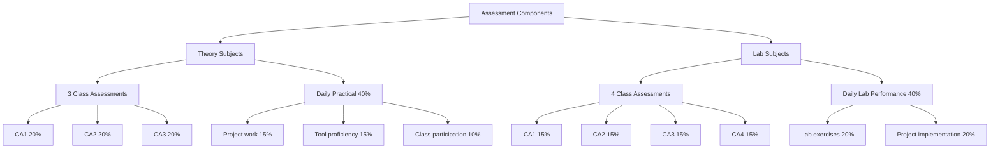
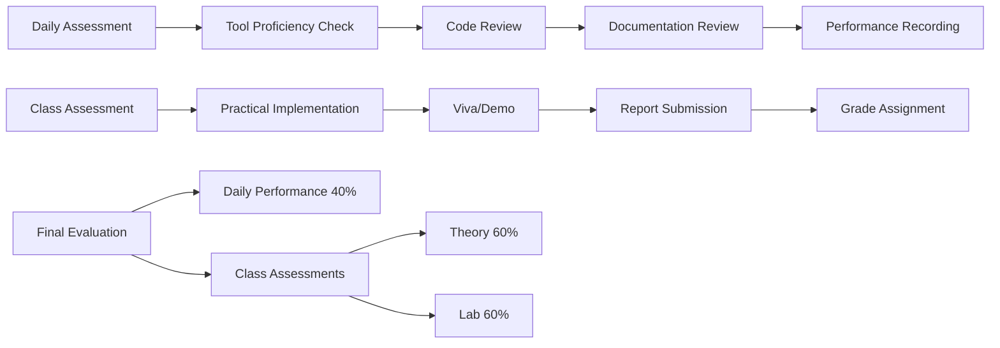
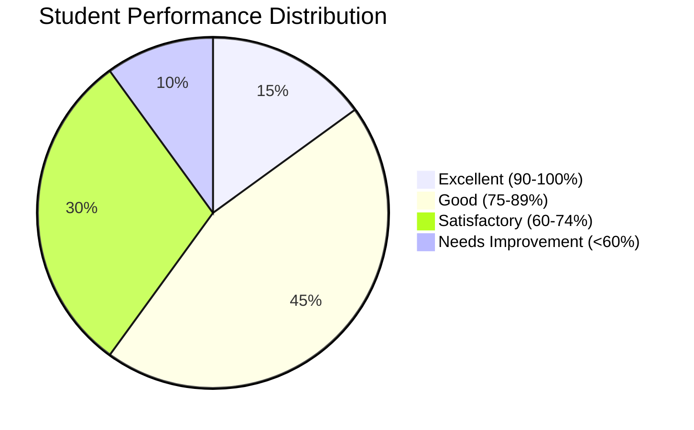
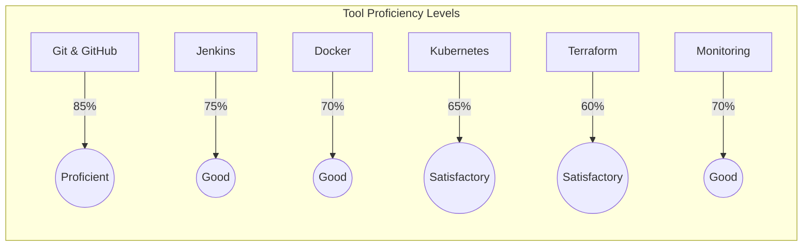
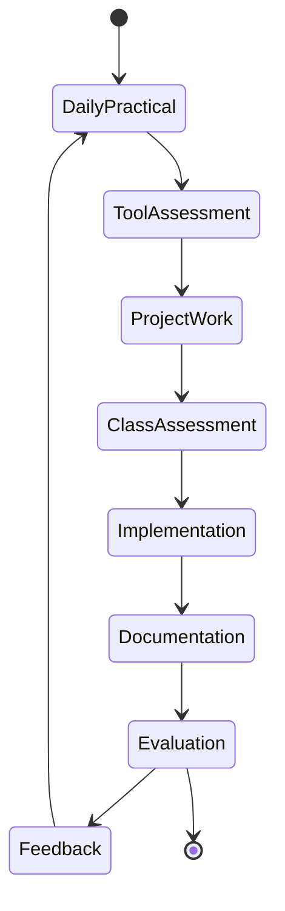

# DevOps Program Assessment Report
## Lovely Professional University
### Prepared by: Gurmeet Singh, DevOps Expert Trainer

## Executive Summary
This report outlines the assessment methodology and student performance metrics for the DevOps program at LPU. The program consists of 9 subjects spread across three years, with a strong emphasis on practical skills and hands-on experience.

## Program Structure and Flow

## Assessment Framework

## Student Evaluation Process

## Assessment Components

### 1. Daily Practical Assessment
#### Evaluation Criteria:
- Tool proficiency
- Problem-solving ability
- Code quality
- Documentation
- Collaboration skills

#### Benchmarks:
- **Excellent (90-100%)**: 
  - Independently completes complex tasks
  - Demonstrates advanced tool usage
  - Produces high-quality documentation
- **Good (75-89%)**:
  - Completes most tasks with minimal guidance
  - Shows solid understanding of tools
  - Maintains good documentation
- **Satisfactory (60-74%)**:
  - Completes basic tasks
  - Demonstrates basic tool knowledge
  - Basic documentation skills
- **Needs Improvement (<60%)**:
  - Requires constant guidance
  - Limited tool understanding
  - Poor documentation

### 2. Class Assessments
Each assessment focuses on specific modules and practical implementation:

#### Theory Subjects:
- **CA1**: Fundamentals and basic concepts
- **CA2**: Tool implementation and usage
- **CA3**: Advanced concepts and integration

#### Lab Subjects:
- **CA1**: Basic tool setup and configuration
- **CA2**: Individual tool mastery
- **CA3**: Integration of multiple tools
- **CA4**: End-to-end implementation

## Subject-Specific Assessment Focus

### 2nd Year
#### CSV101 - DevOps Overview
- Linux command proficiency
- Basic Git operations
- Understanding of DevOps principles

### 3rd Year
#### CSV203/204 - Build & Release Management
- CI/CD pipeline implementation
- Package management
- Containerization skills

#### CSV205/206 - DevOps Automation
- Automation script development
- Monitoring setup
- System integration

### 4th Year
#### CSV401/402 - System Monitoring
- Monitoring tool implementation
- Log analysis
- Performance metrics

#### CSV403/404 - System Provisioning & Code Quality
- Infrastructure as Code
- Code quality analysis
- Cloud resource management

## Student Performance Distribution (2023-24)

## Tool Proficiency Metrics

## Current Performance Metrics (2023-24 Batch)

### Overall Class Performance
- Excellent (90-100%): 15% of students
- Good (75-89%): 45% of students
- Satisfactory (60-74%): 30% of students
- Needs Improvement (<60%): 10% of students

### Tool-specific Proficiency
- Git & GitHub: 85% proficiency
- Jenkins: 75% proficiency
- Docker: 70% proficiency
- Kubernetes: 65% proficiency
- Terraform: 60% proficiency
- Monitoring Tools: 70% proficiency

## Industry Readiness Indicators
- 75% of students can independently set up basic CI/CD pipelines
- 70% can implement basic infrastructure automation
- 65% can set up monitoring solutions
- 80% demonstrate good version control practices

## Assessment Lifecycle

## Areas of Excellence
1. Version Control Systems
   - Strong understanding of Git workflows
   - Proficient in collaboration features
   - Good branching and merging practices

2. Containerization
   - Solid Docker fundamentals
   - Basic container orchestration
   - Understanding of microservices

3. Basic Automation
   - CI/CD pipeline setup
   - Script development
   - Build automation

## Areas Needing Focus
1. Advanced Kubernetes Concepts
   - Complex deployments
   - Service mesh implementation
   - Custom resource definitions

2. Complex Monitoring Solutions
   - Distributed system monitoring
   - Advanced alerting configurations
   - Performance optimization

3. Infrastructure as Code Best Practices
   - Module development
   - State management
   - Security best practices

## Recommendations
1. Increase Hands-on Sessions
   - More lab time for advanced topics
   - Real-world scenario practice
   - Industry-standard tool exposure

2. Implementation of Real-world Projects
   - End-to-end application deployment
   - Multi-tool integration projects
   - Team-based implementations

3. Peer Learning Sessions
   - Student-led demonstrations
   - Knowledge sharing workshops
   - Cross-batch mentoring

4. Enhanced Documentation Focus
   - Technical documentation practices
   - Architecture documentation
   - Project documentation standards

## Conclusion
The current assessment framework effectively evaluates both theoretical knowledge and practical skills. Students show strong performance in fundamental DevOps practices, with areas for improvement in advanced concepts. The daily practical assessment approach ensures continuous learning and skill development. The program successfully prepares students for industry requirements while identifying areas for continuous improvement.
